# DataIntel v2 — Complete Codebase Reference

> **Stack:** NestJS (backend) · Next.js 14 App Router (frontend) · Neon PostgreSQL · Redis · OpenRouter LLM · BullMQ

---

## Table of Contents

1. [System Overview](#1-system-overview)
2. [Repository Layout](#2-repository-layout)
3. [Database Schema](#3-database-schema)
4. [Backend Architecture](#4-backend-architecture)
   - [Module Dependency Map](#module-dependency-map)
   - [Auth Module](#auth-module)
   - [Org Module](#org-module)
   - [Connection Module](#connection-module)
   - [MCP Module](#mcp-module)
   - [LLM Module](#llm-module)
   - [Schema Module](#schema-module)
   - [Memory Module](#memory-module)
   - [Chat Module](#chat-module)
   - [Combo Module](#combo-module)
   - [Query Module](#query-module)
   - [Card Module](#card-module)
   - [Dashboard Module](#dashboard-module)
   - [Dashboard Generation Module](#dashboard-generation-module)
   - [Audit Module](#audit-module)
   - [Redis Module](#redis-module)
5. [Frontend Architecture](#5-frontend-architecture)
   - [Route Map](#route-map)
   - [State Management](#state-management)
   - [API Client](#api-client)
   - [Component Tree](#component-tree)
6. [Feature Data Flows](#6-feature-data-flows)
   - [Authentication](#authentication-flow)
   - [Single-Source Chat Query](#single-source-chat-query-flow)
   - [Multi-Source Combo Query](#multi-source-combo-query-flow)
   - [Dashboard Widget Execution](#dashboard-widget-execution-flow)
   - [AI Dashboard Generation](#ai-dashboard-generation-flow)
   - [Schema Sync & ERD](#schema-sync--erd-flow)
7. [API Endpoint Reference](#7-api-endpoint-reference)
8. [Background Jobs](#8-background-jobs)
9. [Security & Credential Flow](#9-security--credential-flow)
10. [Key Design Patterns](#10-key-design-patterns)

---

## 1. System Overview

DataIntel v2 is a **multi-tenant AI analytics platform** that lets teams query any database using natural language and build living dashboards from the results.

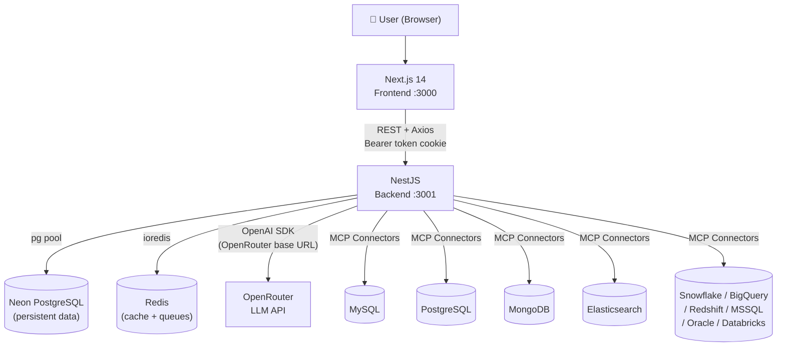

**Core concepts:**
| Concept | Meaning |
|---|---|
| **Connection** | A registered datasource (MySQL, Postgres, etc.) with encrypted credentials |
| **Combo** | A named group of 2+ connections for cross-source queries |
| **Chat** | A persistent conversation thread scoped to a connection or combo |
| **Card** | A versioned, reusable query + visualization saved to a library |
| **Dashboard** | A multi-page grid of widgets, each backed by a Card or inline query |
| **MCP Session** | A short-lived authenticated tunnel to a datasource connector |

---

## 2. Repository Layout

```
DataIntel-v2/
├── backend/                        NestJS application
│   └── src/
│       ├── app.module.ts           Root module (wires everything)
│       ├── main.ts                 Bootstrap: CORS, validation, swagger
│       ├── auth/                   Session-based auth
│       ├── account/                User profile & settings
│       ├── org/                    Organizations, members, hierarchy, invitations
│       ├── connection/             Datasource connection CRUD + health
│       ├── mcp/                    Model Context Protocol connectors (10 DBs)
│       ├── schema/                 In-memory schema graph per session
│       ├── llm/                    OpenRouter inference + prompt builder
│       ├── memory/                 Sliding-window conversation memory
│       ├── chat/                   Chat sessions, messages, query execution
│       ├── combo/                  Multi-source plan → execute → merge
│       ├── query/                  Query orchestration + approval workflow
│       ├── card/                   Analytics card CRUD + versioning
│       ├── dashboard/              Dashboard builder, widgets, cache, versioning
│       ├── dashboard-generation/   AI-driven dashboard scaffolding (BullMQ)
│       ├── audit/                  Append-only audit log
│       ├── redis/                  Redis service wrapper
│       └── database/               pg pool + migrations (013 SQL files)
│
└── frontend/                       Next.js 14 App Router
    └── src/
        ├── app/                    Pages (file-system routing)
        │   ├── login/ register/    Public auth pages
        │   ├── orgs/[slug]/        Org-scoped pages
        │   │   ├── connections/    Connection list, detail, chat, schema, ERD
        │   │   ├── combos/         Combo list + combo chat
        │   │   ├── chats/          Global chat history
        │   │   ├── dashboards/     Dashboard list + builder
        │   │   ├── cards/          Card library
        │   │   ├── members/        Member management
        │   │   ├── audit/          Audit log viewer
        │   │   └── settings/       Org settings + AI provider config
        │   └── layout.tsx          Root layout (AppShell)
        ├── components/
        │   ├── layout/             AppShell, Sidebar, UserDropdown
        │   ├── dashboard/          DashboardBuilder (react-grid-layout)
        │   ├── chat/               ChatBubble sub-components
        │   ├── generative-ui/      AI-suggested chart renderer
        │   └── ui/                 shadcn-style primitives
        ├── lib/
        │   ├── api.ts              All REST calls (Axios)
        │   ├── auth-store.ts       Zustand auth state (persisted)
        │   ├── prefs-store.ts      Zustand UI prefs (showSQL, autoExecute)
        │   └── store.ts            Zustand org store
        └── middleware.ts           Cookie-based route protection
```

---

## 3. Database Schema

**13 migrations applied in order (001 → 013).**

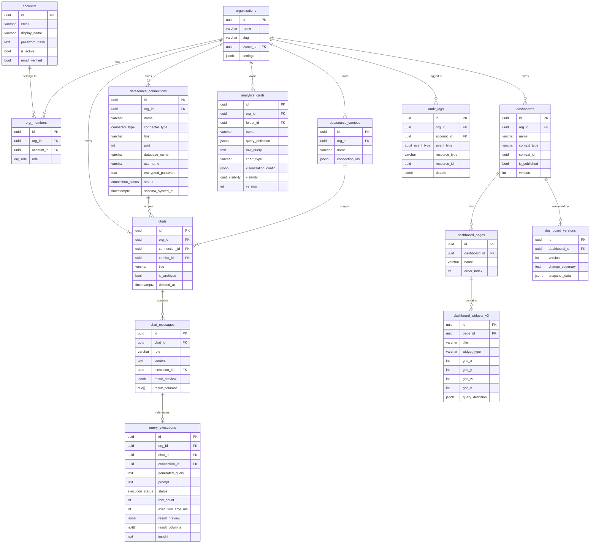

---

## 4. Backend Architecture

### Module Dependency Map

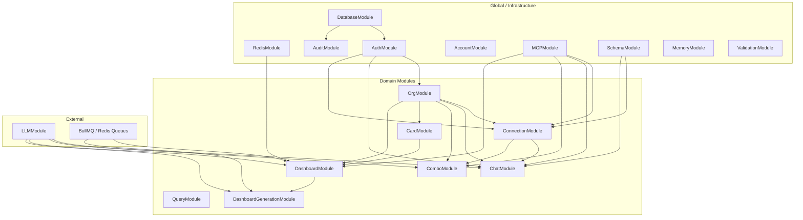

---

### Auth Module

**Files:** `auth/auth.service.ts`, `auth/auth.controller.ts`

**Responsibilities:** Register, login, logout, session token validation.

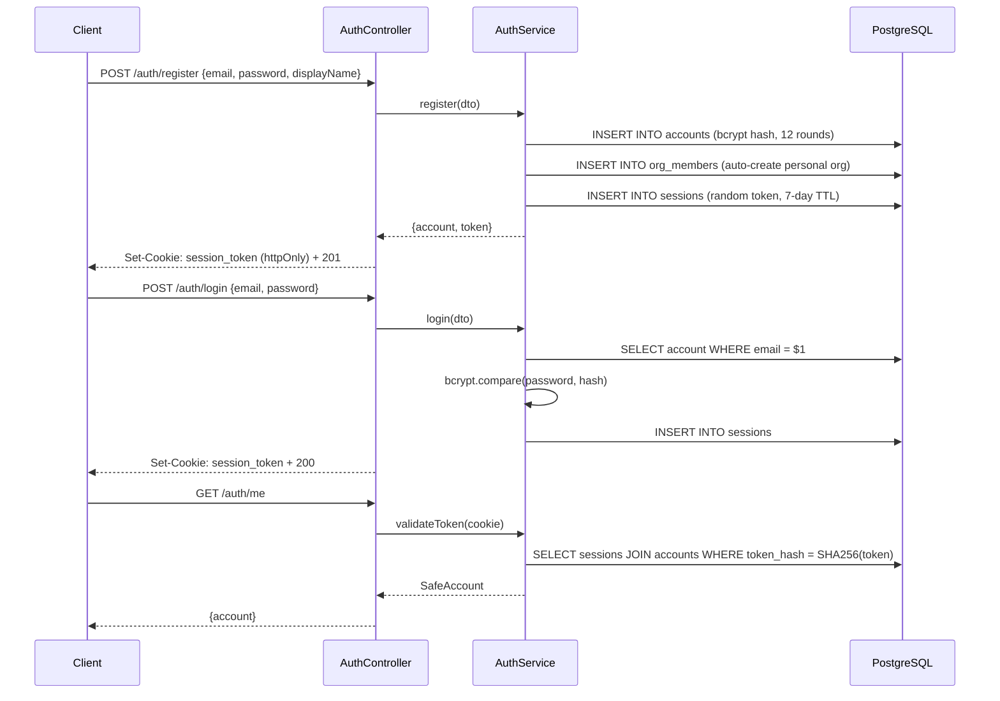

**Session model:** Token is stored **hashed** (SHA-256) in `sessions` table. Each request the `AuthGuard` re-validates by hashing the incoming cookie and looking it up. No JWT — pure DB sessions.

---

### Org Module

**Files:** `org/org.service.ts`, `org/org.controller.ts`, `org/org-permissions.service.ts`, `org/org-hierarchy.service.ts`, `org/org-invitation.service.ts`, `org/org-settings.service.ts`, `org/ai-provider-config.service.ts`

**Responsibilities:** CRUD for organizations and members, role enforcement, invitation workflow, org hierarchy (parent→child), per-org AI provider overrides.

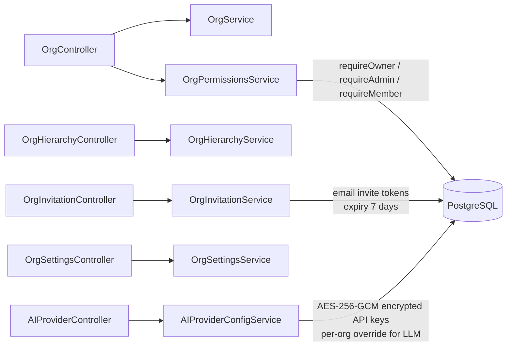

**Role hierarchy:** `owner > admin > editor > viewer`

Every sensitive backend operation calls `OrgPermissionsService.requireMember(orgId, userId)` (or a stricter variant) before touching data.

---

### Connection Module

**Files:** `connection/connection.service.ts`, `connection.controller.ts`, `connection-health.service.ts`, `credential-vault.service.ts`, `persistent-connection.service.ts`, `schema-explorer.controller.ts`

**Responsibilities:** Persist datasource credentials (encrypted), test connections, sync schema, health checks.

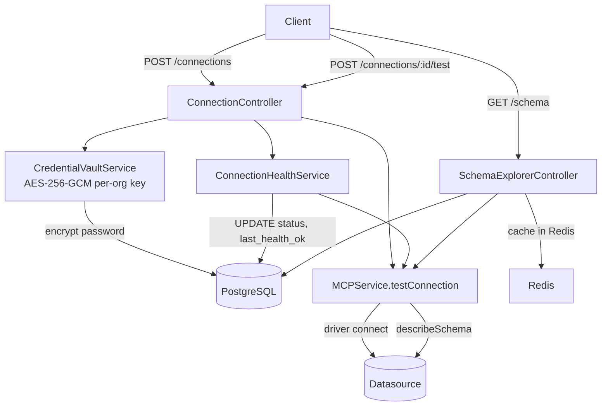

**Credential Vault:** Each org gets an HKDF-derived sub-key from the master `CREDENTIAL_ENCRYPTION_KEY`. Passwords are encrypted with **AES-256-GCM** (IV + ciphertext + auth tag stored together). Decryption happens only at query time inside the backend process — credentials never leave the server.

---

### MCP Module

**Files:** `mcp/mcp.service.ts`, `mcp/connectors/*.connector.ts` (10 connectors)

**Responsibilities:** Manage short-lived "sessions" (authenticated tunnels) to datasources. Execute read-only queries. Enforce row limits.

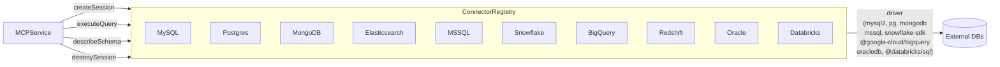

**Session lifecycle:**
1. `createSession(params)` → decrypt password → driver connect → verify read-only → assign UUID session ID
2. `executeQuery(sessionId, sql)` → run query with 30s timeout, cap at 500 rows → return `{rows, columns, executionTimeMs}`
3. `destroySession(sessionId)` → driver disconnect → delete from session map

Each connector implements the `IMCPConnector` interface:
```
testConnection(params) → {success, executionTimeMs}
describeSchema(params) → SchemaMetadata
executeReadQuery(params, query) → MCPQueryResult
getCapabilities() → ConnectorCapabilities
dispose() → void
```

---

### LLM Module

**Files:** `llm/llm.service.ts`, `llm/prompt-builder.service.ts`, `llm/llm-provider.registry.ts`, `llm/llm-usage.tracker.ts`

**Responsibilities:** Call OpenRouter (GPT-4/Claude/etc.), build structured prompts, retry on JSON parse failure.

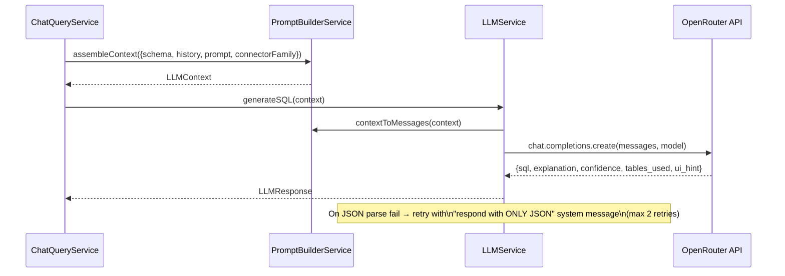

**LLMResponse shape:**
```json
{
  "sql": "SELECT ...",
  "explanation": "This query fetches...",
  "confidence": 0.92,
  "tables_used": ["orders", "customers"],
  "ui_hint": "bar_chart"
}
```

**ui_hint values:** `bar_chart`, `line_chart`, `pie_chart`, `data_table`, `metric_card`, `stat_grid`, `list`

---

### Schema Module

**Files:** `schema/schema.service.ts`, `schema/schema-graph.ts`

**Responsibilities:** Build and cache an in-memory graph of a datasource's schema (tables, columns, FK relationships). Compress it to a token-efficient string for LLM context.

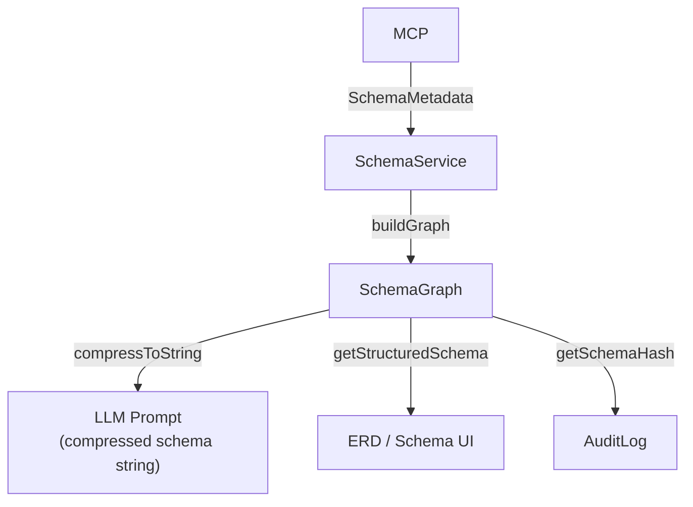

`SchemaGraph` maps tables → columns → foreign keys as an adjacency structure. `compressToString()` produces a compact representation like:
```
orders(id:int PK, customer_id:int FK→customers.id, total:decimal, created_at:timestamp)
customers(id:int PK, name:varchar, email:varchar)
```

---

### Memory Module

**Files:** `memory/memory.service.ts`

**Responsibilities:** Sliding-window conversation memory for LLM context. Keeps last N messages, summarizes older ones when token budget is exceeded.

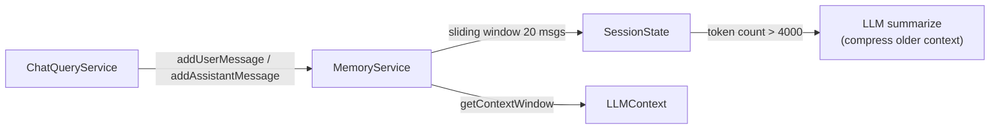

**SessionState fields:** `messages[]`, `summary`, `referencedTables[]`, `previousQueries[]`, `derivedMetrics{}`

---

### Chat Module

**Files:** `chat/chat.service.ts`, `chat/chat.controller.ts`, `chat/chat-query.service.ts`, `chat/chat-stream.controller.ts`, `chat/chat-promotion.service.ts`, `chat/query-execution.service.ts`

**Responsibilities:** Chat CRUD, message persistence, AI query execution, SSE streaming, promoting messages to cards.

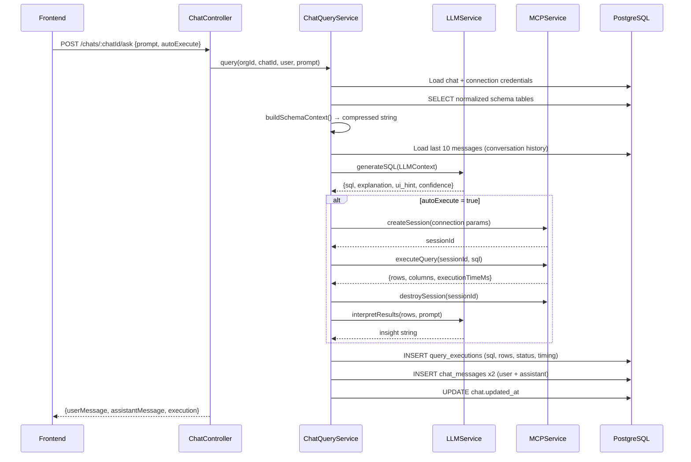

**`executeDraft` flow** (user edits SQL and re-runs):
```
POST /chats/:chatId/execute-draft {sql, executionId?}
→ load chat → get connection → createSession → executeQuery
→ UPDATE query_executions if executionId provided
→ return {rows, columns, row_count, execution_time_ms}
```

**SSE stream** (`chat-stream.controller.ts`): emits events `thinking → sql_generated → executing → results → insight → done` for real-time UI updates.

---

### Combo Module

**Files:** `combo/combo.service.ts`, `combo/combo-planner.service.ts`, `combo/combo-executor.service.ts`, `combo/result-merger.service.ts`, `combo/schema-merger.service.ts`

**Responsibilities:** Multi-datasource query planning, parallel execution, and result merging.

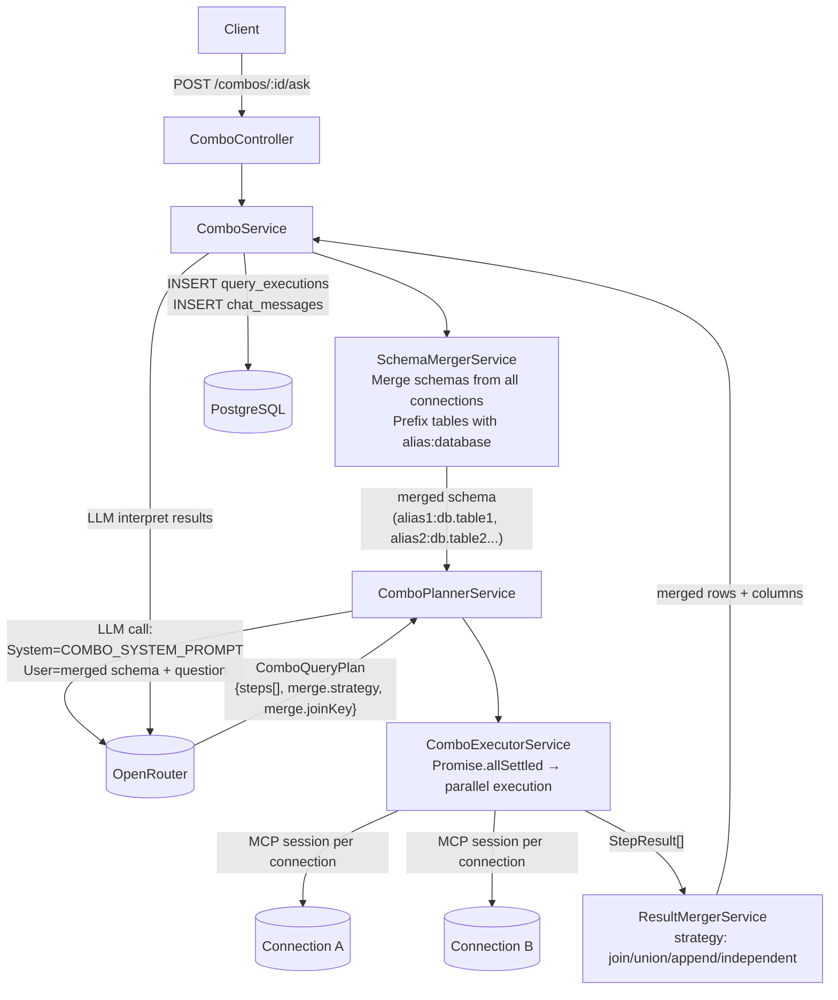

**Merge strategies:**
| Strategy | When used | How |
|---|---|---|
| `join` | Sources share a common key (user_id, region, date) | In-memory hash join on `joinKey` |
| `union` | Sources have identical schema | Row concatenation |
| `append` | Different schemas, show together | Side-by-side concatenation |
| `independent` | Unrelated results | Return as separate arrays |

---

### Query Module

**Files:** `query/query.service.ts`, `query/query-orchestration.service.ts`, `query/query-approval.service.ts`, `query/query.controller.ts`, `query/query-approval.controller.ts`

**Responsibilities:** Direct query execution (outside chat), approval workflow for sensitive queries.

```mermaid
flowchart TD
    Client -->|POST /query/ask| QC[QueryController]
    QC --> QO[QueryOrchestrationService]
    QO -->|high-risk query| QA[QueryApprovalService]
    QA -->|INSERT query_approval_requests| DB[(PostgreSQL)]
    QA -->|EventEmitter: query.approval.requested| AdminNotification

    Admin -->|PUT /query-approvals/:id {status: approved}| QAC[QueryApprovalController]
    QAC --> QA
    QA -->|approved → execute| MCPService

    QO -->|low-risk| MCPService
    MCPService -->|results| QO
    QO --> DB
```

---

### Card Module

**Files:** `card/card.service.ts`, `card/card.controller.ts`, `card/card-folder.controller.ts`

**Responsibilities:** Save reusable queries as versioned analytics cards. Organize into folders. Control visibility (private/org/public).

```mermaid
flowchart LR
    Client -->|POST /cards| CardController
    CardController --> CardService
    CardService -->|INSERT analytics_cards\n(version=1, status=draft)| DB[(PostgreSQL)]

    Client -->|POST /cards/:id/publish| CardController
    CardService -->|INSERT card_versions snapshot\nUPDATE status=published| DB

    Client -->|PATCH /cards/:id| CardController
    CardService -->|INSERT new card_versions\nUPDATE version++| DB

    Client -->|POST /cards/:id/rollback/:versionId| CardController
    CardService -->|restore from card_versions snapshot| DB

    CardService -->|EventEmitter: card.published| DashboardService
```

---

### Dashboard Module

**Files:** `dashboard/dashboard-builder.service.ts`, `dashboard/dashboard.controller.ts`, `dashboard/widget-execution.service.ts`, `dashboard/dashboard-cache.service.ts`, `dashboard/dashboard-permissions.service.ts`, `dashboard/widget-refresh.processor.ts`

**Responsibilities:** Multi-page dashboard CRUD, drag-and-drop layout persistence, widget query execution with Redis caching, versioning and restore.

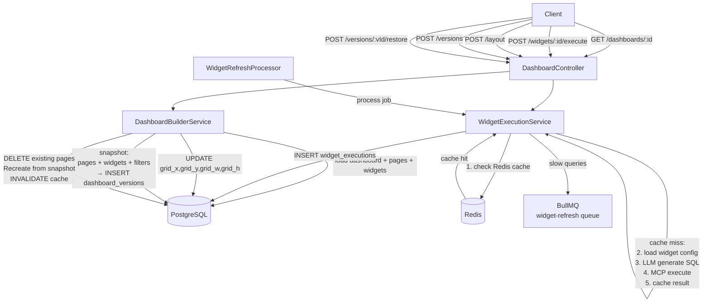

**Cache TTLs** (Redis):
- Widget results: 5 minutes (configurable)
- Dashboard draft layout: 15 minutes
- Schema data: 30 minutes

---

### Dashboard Generation Module

**Files:** `dashboard-generation/dashboard-generation.service.ts`, `dashboard-generation.controller.ts`, `dashboard-generation.processor.ts`, `layout-engine.service.ts`, `widget-recommendation.service.ts`

**Responsibilities:** AI-driven "generate a dashboard from a description" feature. Queued via BullMQ so it's non-blocking.

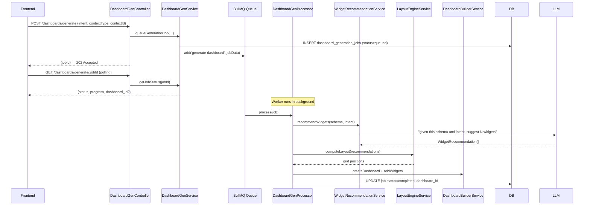

---

### Audit Module

**Files:** `audit/audit.service.ts`

Append-only log. Every mutation (create/update/delete) in every domain calls `auditService.log({orgId, accountId, eventType, resourceType, resourceId, details})`. Failures are swallowed so audit never crashes the application.

**Event types (33 total):** account_created, login_success, login_failed, logout, password_changed, org_created, org_updated, member_invited, member_removed, member_role_changed, org_invitation_sent/accepted/revoked, connection_created/updated/deleted/test_success/test_failed/health_check/schema_synced/credentials_rotated, query_generated/validated/executed/failed/approval_requested/granted/rejected, chat_created/archived/unarchived/deleted/message_promoted, dashboard_created/updated/published/deleted/page_created/page_deleted/generated, widget_added/removed/executed/cache_invalidated, card_created/updated/published/deleted/version_rollback, combo_created/updated/deleted

---

### Redis Module

**Files:** `redis/redis.service.ts`, `redis/redis.constants.ts`

Thin wrapper around `ioredis`. Key namespaces:

| Prefix | Contents | TTL |
|---|---|---|
| `di:widget:result:{id}` | Cached widget query results | 5 min |
| `di:dashboard:layout:{dashId}:*` | Draft layout state | 15 min |
| `di:schema:{connId}` | Introspected schema | 30 min |
| BullMQ keys | Job state (managed by BullMQ) | Automatic |

---

## 5. Frontend Architecture

### Route Map

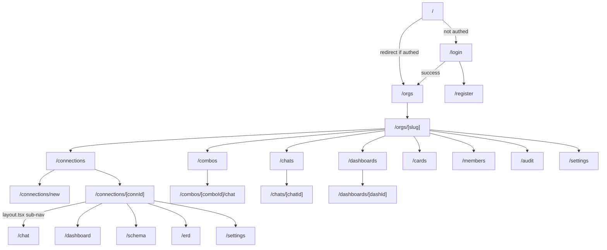

### State Management

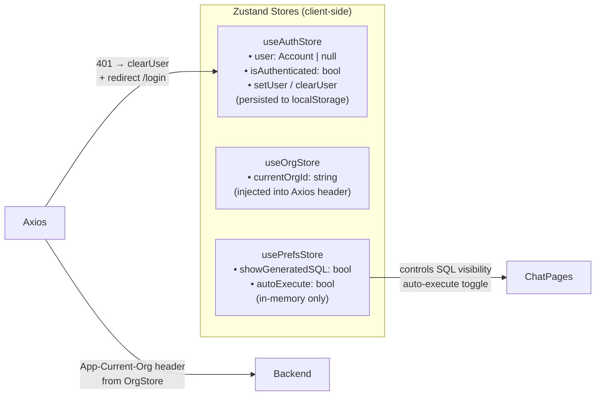

### API Client

`lib/api.ts` organizes calls into domain objects. All calls go through a shared `apiFetch()` wrapper (Axios under the hood) which:
- Injects `App-Current-Org` header automatically
- Intercepts 401 → clears auth store → redirects to `/login`
- Returns typed responses via `handleResponse<T>()`

```
authApi     → /auth/register, /auth/login, /auth/logout, /auth/me
orgApi      → /orgs, /orgs/:slug, /orgs/:id/members
connectionApi → /orgs/:id/connections, /test, /schema
chatApi     → /orgs/:id/chats, /ask, /execute-draft, /archive
comboApi    → /orgs/:id/combos
cardApi     → /orgs/:id/cards, /publish, /rollback
dashboardApi → /orgs/:id/dashboards, /layout, /widgets, /versions, /restore
```

### Component Tree

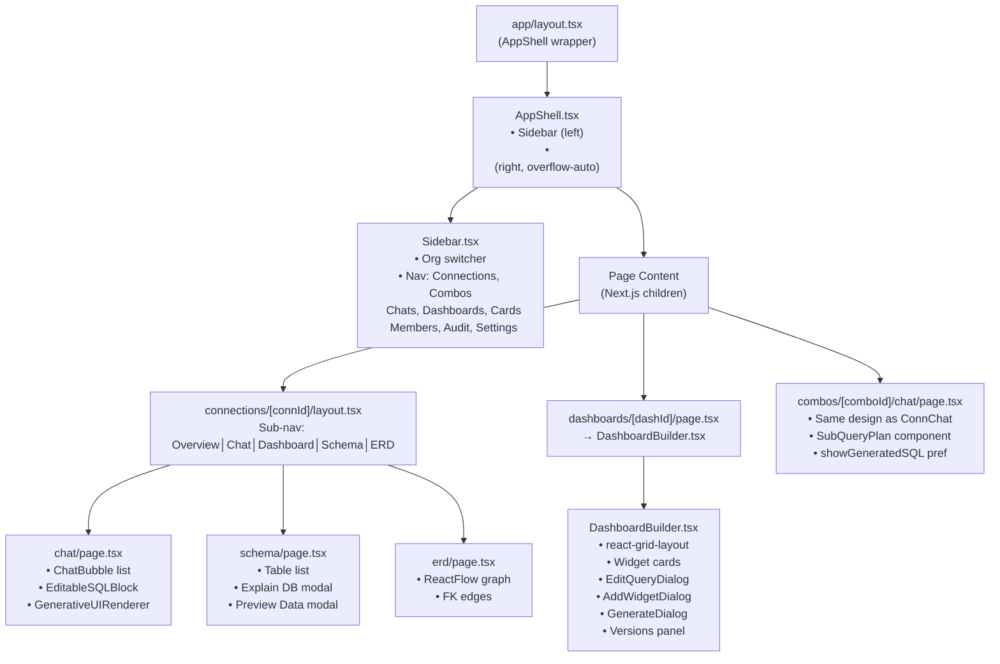

---

## 6. Feature Data Flows

### Authentication Flow

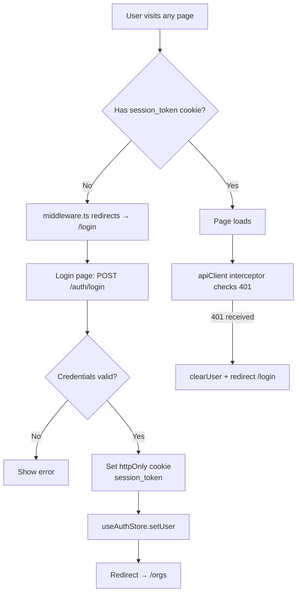

---

### Single-Source Chat Query Flow

```mermaid
flowchart TD
    User["User types question"] --> Input["handleSend()"]
    Input -->|"chatApi.ask(orgId, chatId, prompt, autoExecute)"| API["POST /chats/:chatId/ask"]

    API --> ChatQS["ChatQueryService.query()"]
    ChatQS --> LoadConn["1. Load connection + decrypt password"]
    LoadConn --> SchemaCtx["2. Build schema context\n(SELECT FROM schema_columns table)"]
    SchemaCtx --> History["3. Load last 10 messages\n(conversation history)"]
    History --> GenSQL["4. LLMService.generateSQL(context)"]
    GenSQL --> LLMResp["{sql, ui_hint, confidence, tables_used}"]

    LLMResp --> AutoExec{autoExecute?}

    AutoExec -->|true| MCP["5. MCPService.createSession\n→ executeQuery(sql)\n→ destroySession"]
    MCP --> Rows["{rows, columns, executionTimeMs}"]
    Rows --> Insight["6. LLMService.generateInsight(rows, prompt)"]
    Insight --> Persist["7. INSERT query_executions\n   INSERT chat_messages x2"]

    AutoExec -->|false| PendingSQL["Return generated_query as pending\nUI shows editable SQL block"]
    PendingSQL --> UserEditSQL["User edits SQL"]
    UserEditSQL -->|"chatApi.executeDraft(sql)"| ExecDraft["POST /execute-draft\n→ MCP execute\n→ UPDATE query_executions"]

    Persist --> FEUpdate["Frontend state update\n• Message list + results\n• GenerativeUIRenderer\n  renders chart/table/metric"]
```

---

### Multi-Source Combo Query Flow

```mermaid
flowchart TD
    User --> ComboChat["combos/[comboId]/chat page\nPOST /combos/:comboId/ask"]

    ComboService --> LoadConns["Load all combo connections\n+ decrypt each password"]
    LoadConns --> SchemaMerger["SchemaMergerService\nMerge schemas from all connections\nPrefix: alias1:db.table, alias2:db.table"]
    SchemaMerger --> Planner["ComboPlannerService\nLLM call with merged schema\n→ ComboQueryPlan"]
    Planner --> Plan["{steps[], merge.strategy, merge.joinKey}"]

    Plan --> Executor["ComboExecutorService\nPromise.allSettled → parallel"]
    Executor -->|step 1| MCP1["MCP Session → Connection A"]
    Executor -->|step 2| MCP2["MCP Session → Connection B"]
    MCP1 --> StepResults["StepResult[]"]
    MCP2 --> StepResults

    StepResults --> Merger["ResultMergerService"]
    Merger -->|join| HashJoin["in-memory hash join on joinKey"]
    Merger -->|union| Concat["row concatenation"]
    Merger -->|append| SideBySide["side-by-side columns"]

    Merger --> MergedRows["merged rows + columns"]
    MergedRows --> LLMInsight["LLMService.generateInsight"]
    LLMInsight --> Persist["INSERT query_executions\nINSERT chat_messages"]
    Persist --> FEUpdate["Frontend: SubQueryPlan\n(collapsible per-source breakdown)\n+ merged result table/chart"]
```

---

### Dashboard Widget Execution Flow

```mermaid
flowchart TD
    FE["Dashboard loads\n(DashboardBuilder mounts)"]
    FE -->|"GET /dashboards/:id"| API
    API -->|"pages + widgets with result_rows"| FE
    FE --> RGL["react-grid-layout renders\nwidget grid"]

    RGL --> WidgetCard["WidgetCard component\nrenders cached result_rows\n(no re-query on mount)"]

    User -->|click Refresh| FE
    FE -->|"POST /widgets/:id/execute?force=true"| WES["WidgetExecutionService"]
    WES -->|"1. Check Redis cache"| Redis[(Redis)]
    Redis -->|cache miss| WES
    WES -->|"2. Load widget.query_definition\n(prompt + connection)"| DB
    WES -->|"3. LLM generate SQL from prompt"| LLM
    LLM --> SQL["generated SQL"]
    SQL -->|"4. MCP execute"| DS[(Datasource)]
    DS --> Rows["{rows, columns}"]
    Rows -->|"5. Cache in Redis (5 min)"| Redis
    Rows -->|"6. INSERT widget_executions"| DB
    Rows -->|"7. UPDATE widget result_rows"| DB
    WES --> FE

    User -->|"Edit Query"| EditDialog["EditQueryDialog\nMode: Prompt | SQL"]
    EditDialog -->|prompt mode| ChatAsk["chatApi.ask()"]
    EditDialog -->|sql mode| ExecDraft["chatApi.executeDraft()"]
    EditDialog -->|Apply| FE
    FE -->|"PATCH /widgets/:id"| API
    API -->|"UPDATE query_definition + result"| DB
```

---

### AI Dashboard Generation Flow

```mermaid
sequenceDiagram
    participant FE as DashboardBuilder UI
    participant DGC as DashGenController
    participant DGS as DashGenService
    participant Q as BullMQ
    participant P as DashGenProcessor
    participant WR as WidgetRecommendationService
    participant LE as LayoutEngineService
    participant LLM as LLMService

    FE->>DGC: POST /dashboards/generate {intent: "Sales overview", contextId}
    DGC->>DGS: queueGenerationJob()
    DGS->>DB: INSERT dashboard_generation_jobs (queued)
    DGS->>Q: enqueue('generate-dashboard', {jobId, intent})
    DGC-->>FE: {jobId} 202

    loop Poll every 2s
        FE->>DGC: GET /generate/:jobId
        DGC-->>FE: {status, progress}
    end

    Q->>P: process job
    P->>WR: recommendWidgets(schema, intent)
    WR->>LLM: "Suggest 6 widgets for: Sales overview"
    LLM-->>WR: [{title, prompt, chartType, gridW, gridH}, ...]
    P->>LE: computeLayout(recommendations)
    LE-->>P: [{x,y,w,h}, ...]
    P->>DB: INSERT dashboard + page + widgets
    P->>DB: UPDATE job status=completed, dashboard_id
    FE->>DGC: GET /generate/:jobId
    DGC-->>FE: {status: completed, dashboard_id}
    FE->>FE: navigate to new dashboard
```

---

### Schema Sync & ERD Flow

```mermaid
flowchart TD
    User -->|"click 'Sync Schema'"| SchemaPage
    SchemaPage -->|"POST /connections/:id/schema/sync"| SE[SchemaExplorerController]
    SE --> MCP[MCPService.createSession]
    MCP --> Connector[Connector.describeSchema]
    Connector -->|tables + columns + PKs + FKs| MCP
    MCP --> SE
    SE -->|"UPSERT schema_tables\nUPSERT schema_columns\nUPDATE schema_synced_at"| DB[(PostgreSQL)]
    SE -->|"cache schema in Redis"| Redis
    SE --> SchemaGraph["SchemaService.buildGraph(sessionId, metadata)"]

    SchemaPage -->|"GET /connections/:id/schema"| DB
    DB --> Tables["tables[] with column_count, fk_count"]
    Tables --> SchemaPage

    User -->|navigate to ERD| ERDPage
    ERDPage -->|"GET /connections/:id/schema"| DB
    DB --> Nodes["tables as ReactFlow nodes\nFKs as edges"]
    Nodes --> ReactFlow["@xyflow/react\nforce-directed layout"]
```

---

## 7. API Endpoint Reference

### Auth `/api/auth`
| Method | Path | Description |
|---|---|---|
| POST | `/register` | Create account + auto-join/create org |
| POST | `/login` | Validate credentials → set session cookie |
| POST | `/logout` | Invalidate session token |
| GET | `/me` | Return current authenticated user |

### Orgs `/api/orgs`
| Method | Path | Description |
|---|---|---|
| GET | `/` | List orgs for current user |
| POST | `/` | Create new org |
| GET | `/:slug` | Get org by slug (resolves to UUID internally) |
| PATCH | `/:orgId` | Update org name/description |
| GET | `/:orgId/members` | List members |
| POST | `/:orgId/members` | Invite member |
| DELETE | `/:orgId/members/:accountId` | Remove member |
| GET | `/:orgId/invitations` | List pending invitations |
| POST | `/:orgId/invitations` | Send invitation email |
| DELETE | `/:orgId/invitations/:id` | Revoke invitation |
| GET/PUT | `/:orgId/settings` | Org settings |
| GET/POST/DELETE | `/:orgId/ai-providers` | Per-org LLM provider config |

### Connections `/api/orgs/:orgId/connections`
| Method | Path | Description |
|---|---|---|
| GET | `/` | List connections |
| POST | `/` | Create connection (encrypts password) |
| GET | `/:id` | Get connection detail |
| PATCH | `/:id` | Update connection |
| DELETE | `/:id` | Delete connection |
| POST | `/:id/test` | Test connection (no persist) |
| POST | `/:id/health/check` | Run health check |
| GET | `/:id/health` | Get last health status |
| GET | `/:id/schema` | Get synced schema |
| POST | `/:id/schema/sync` | Re-introspect and save schema |

### Chats `/api/orgs/:orgId/chats`
| Method | Path | Description |
|---|---|---|
| GET | `/` | List chats (filter by connectionId, comboId, isArchived) |
| POST | `/` | Create new chat |
| GET | `/:chatId` | Get chat + messages |
| GET | `/:chatId/messages` | Get messages |
| POST | `/:chatId/ask` | Send prompt → AI query → response |
| POST | `/:chatId/execute-draft` | Re-execute user-edited SQL |
| POST | `/:chatId/stream` | SSE stream version of ask |
| POST | `/:chatId/archive` | Archive chat |
| POST | `/:chatId/unarchive` | Unarchive chat |
| DELETE | `/:chatId` | Soft-delete chat |
| POST | `/:chatId/messages/:msgId/promote` | Promote message to card |

### Combos `/api/orgs/:orgId/combos`
| Method | Path | Description |
|---|---|---|
| GET | `/` | List combos |
| POST | `/` | Create combo |
| GET | `/:id` | Get combo |
| PATCH | `/:id` | Update combo |
| DELETE | `/:id` | Delete combo |
| POST | `/:id/ask` | Multi-source AI query |

### Cards `/api/orgs/:orgId/cards`
| Method | Path | Description |
|---|---|---|
| GET | `/` | List cards (filter by folder, tags, visibility) |
| POST | `/` | Create card (draft) |
| GET | `/:id` | Get card |
| PATCH | `/:id` | Update card (creates new version) |
| DELETE | `/:id` | Delete card |
| POST | `/:id/publish` | Publish card |
| GET | `/:id/versions` | List version history |
| POST | `/:id/rollback/:versionId` | Restore card to version |
| GET/POST/DELETE | `/folders` | Card folder management |

### Dashboards `/api/orgs/:orgId/dashboards`
| Method | Path | Description |
|---|---|---|
| GET | `/` | List dashboards |
| POST | `/` | Create dashboard |
| GET | `/:id` | Get dashboard + pages + widgets |
| PATCH | `/:id` | Update metadata |
| DELETE | `/:id` | Soft-delete |
| POST | `/:id/publish` | Publish dashboard |
| POST | `/:id/layout` | Save widget grid positions |
| POST | `/:id/pages` | Add page |
| DELETE | `/:id/pages/:pageId` | Delete page |
| POST | `/:id/pages/:pageId/widgets` | Add widget |
| PATCH | `/:id/pages/:pageId/widgets/:wId` | Update widget |
| DELETE | `/:id/pages/:pageId/widgets/:wId` | Delete widget |
| POST | `/:id/pages/:pageId/widgets/:wId/execute` | Execute widget query |
| GET | `/:id/pages/:pageId/widgets/:wId/inspect` | Inspect last execution |
| GET | `/:id/versions` | List versions |
| POST | `/:id/versions` | Save new version |
| POST | `/:id/versions/:vId/restore` | Restore to version |
| GET | `/:id/filters` | List dashboard filters |
| POST | `/:id/filters` | Add filter |
| DELETE | `/:id/filters/:fId` | Remove filter |

### Dashboard Generation `/api/orgs/:orgId/dashboards/generate`
| Method | Path | Description |
|---|---|---|
| POST | `/` | Queue AI generation job |
| GET | `/:jobId` | Poll job status |

---

## 8. Background Jobs

**Queue infrastructure:** BullMQ backed by Redis.

```mermaid
flowchart LR
    subgraph Queues["BullMQ Queues"]
        WRQ["widget-refresh\nrefresh stale widget data\nnightly or on-demand"]
        DGQ["dashboard-generation\nAI scaffold a full dashboard\nfrom intent string"]
    end

    WRQ --> WRP["WidgetRefreshProcessor\n→ WidgetExecutionService.executeSync()"]
    DGQ --> DGP["DashboardGenerationProcessor\n→ DashboardGenerationService.processGenerationJob()"]

    WRP --> MCP
    WRP --> LLM
    DGP --> LLM
    DGP --> DashboardBuilderService
```

**Job data shapes:**
```json
// widget-refresh
{ "widgetId": "uuid", "orgId": "uuid", "forceRefresh": true }

// dashboard-generation
{ "jobId": "uuid", "orgId": "uuid", "userId": "uuid",
  "intent": "Sales overview with revenue trends",
  "contextType": "connection", "contextId": "uuid" }
```

---

## 9. Security & Credential Flow

```mermaid
flowchart TD
    User -->|"POST /connections {password: 'secret'}"| BE

    subgraph BE["Backend (never exposes credentials)"]
        CV["CredentialVaultService\nHKDF(masterKey, orgId) → orgKey\nAES-256-GCM(orgKey, password) → {iv, data, tag}"]
        DB["PostgreSQL\nstores: encrypted_password (iv+data+tag)"]
        AT["At query time only:\ndecrypt → pass to MCP session\nMCP session holds in memory\nDestroyed after query"]
    end

    CV --> DB
    DB --> AT
    AT --> MCP["MCP Connector\nPassword in memory for\nduration of 1 query only"]
    MCP --> DS[(Datasource)]

    style BE fill:#1a1a2e,stroke:#e94560,color:#eee
```

**Key security properties:**
- Passwords **never returned** to frontend in any API response
- Master key in env var, per-org sub-key via HKDF (compromise of one org's data doesn't expose others)
- Auth tokens stored as **SHA-256 hashes** in DB (raw token only sent to client once, in cookie)
- All queries are **read-only enforced** at connector level
- Row limit enforced at MCP level (`MCP_MAX_RESULT_ROWS`, default 500)
- Rate limiting: 300 req/min (short), 1000 req/15min (medium) via ThrottlerGuard

---

## 10. Key Design Patterns

### Pattern 1 — MCP Session Lifecycle
Every query creates a fresh MCP session (connect, query, disconnect). Sessions are never reused across requests. This prevents connection leaks and ensures credential isolation.

### Pattern 2 — Schema in PostgreSQL, not MCP
Schema introspection runs once (on sync) and is stored in `schema_tables` / `schema_columns` tables in Postgres. Chat queries read schema from Postgres (fast), not from the live datasource (slow). This makes LLM context building cheap.

### Pattern 3 — LLM as Query Planner Only
The LLM generates SQL or a query plan. It **never sees actual data rows**. Only after execution does the LLM receive a compact row summary (max 10 rows) to generate an insight/interpretation. This minimizes token costs and data exposure.

### Pattern 4 — Two-Phase Chat Execution
```
autoExecute=true  → LLM generates SQL → MCP executes → return results
autoExecute=false → LLM generates SQL → return SQL as draft → user reviews
                    → user hits Execute → POST /execute-draft → MCP executes
```
The `autoExecute` preference is stored in Zustand (`usePrefsStore`) and sent with every `/ask` request.

### Pattern 5 — Combo Merge in Application Layer
Cross-source joins cannot happen in a single database. The backend runs queries in parallel against each source, then merges the result sets in-memory using hash join (or union/append). The LLM plans the merge strategy but does not execute it.

### Pattern 6 — Dashboard Widget Caching
Widgets display **cached** results on page load (no query on mount). Users can force-refresh individual widgets. Widget results are cached in Redis with a 5-minute TTL. Stale widgets are re-queued via BullMQ for background refresh.

### Pattern 7 — Inline Confirmation (no `window.confirm`)
All destructive actions (delete chat, delete connection, delete member, delete dashboard page) use a two-click inline pattern:
1. First click → set `confirmingId` state → button swaps to "Delete? ✓ ✗"
2. Click ✓ → execute action
3. Click ✗ → reset state

### Pattern 8 — Versioned Everything
Cards and dashboards are versioned. Every "Save" on a dashboard creates a `dashboard_versions` snapshot (full JSON of pages + widgets + filters). Restore replays that snapshot to rebuild the live state.

---

*Generated from codebase at `C:/Users/user/Desktop/DataIntel-v2` — June 2026*
