# DataIntel — Complete Multi-Tenant Implementation Plan

> **Current:** Single-tenant · single-connection · fully in-memory · no auth  
> **Target:** Multi-org · multi-datasource · cookie-auth · MySQL persisted · Redis-backed dashboards · PowerBI multi-page

---

## Table of Contents

1. [System Architecture Overview](#1-system-architecture-overview)
2. [Database Schema — Full DDL](#2-database-schema--full-ddl)
3. [Entity Relationship Diagram](#3-entity-relationship-diagram)
4. [Redis Key Design](#4-redis-key-design)
5. [Auth & Session Flow](#5-auth--session-flow)
6. [Org & Role Model](#6-org--role-model)
7. [Datasource Connection Lifecycle](#7-datasource-connection-lifecycle)
8. [Query Pipeline (Chat Level)](#8-query-pipeline-chat-level)
9. [Dashboard State Machine](#9-dashboard-state-machine)
# DataIntel — Complete Multi-Tenant Implementation Plan

> **Current:** Single-tenant · single-connection · fully in-memory · no auth  
> **Target:** Multi-org · multi-datasource · cookie-auth · MySQL persisted · Redis-backed dashboards · PowerBI multi-page

---

## Table of Contents

1. [System Architecture Overview](#1-system-architecture-overview)
2. [Database Schema — Full DDL](#2-database-schema--full-ddl)
3. [Entity Relationship Diagram](#3-entity-relationship-diagram)
4. [Redis Key Design](#4-redis-key-design)
5. [Auth & Session Flow](#5-auth--session-flow)
6. [Org & Role Model](#6-org--role-model)
7. [Datasource Connection Lifecycle](#7-datasource-connection-lifecycle)
8. [Query Pipeline (Chat Level)](#8-query-pipeline-chat-level)
9. [Dashboard State Machine](#9-dashboard-state-machine)
10. [Health Check & Monitoring Flow](#10-health-check--monitoring-flow)
11. [Frontend Routing & Page Tree](#11-frontend-routing--page-tree)
12. [Backend Module Graph](#12-backend-module-graph)
13. [API Route Map](#13-api-route-map)
14. [Implementation Phases](#14-implementation-phases)
15. [Audit Log Event Catalogue](#15-audit-log-event-catalogue)
16. [Migration Strategy](#16-migration-strategy)
17. [Design System & Unified UI Architecture](#17-design-system--unified-ui-architecture)

---

## 1. System Architecture Overview

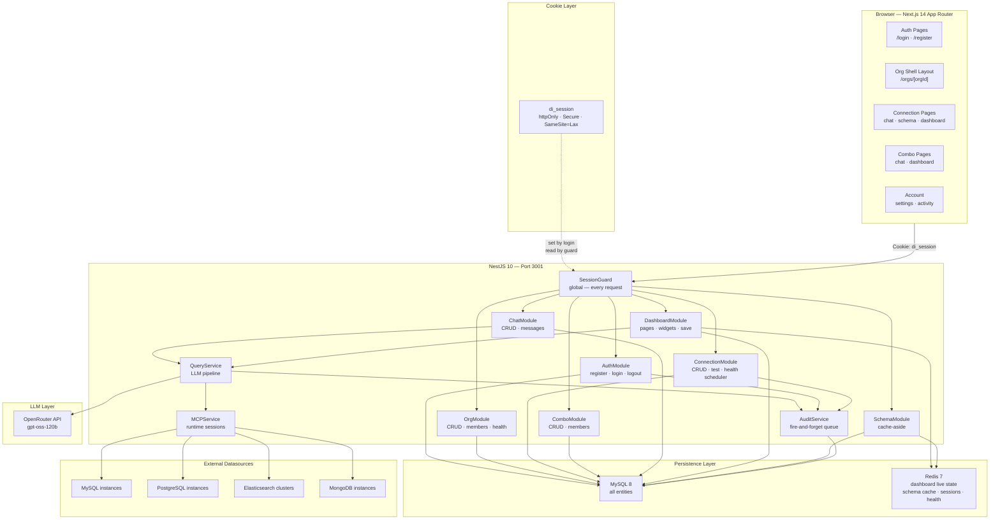

---

## 2. Database Schema — Full DDL

```sql
-- ============================================================
-- DataIntel Persistence Database — MySQL 8.0+
-- ============================================================

SET FOREIGN_KEY_CHECKS = 0;

-- ── ACCOUNTS & AUTH ─────────────────────────────────────────

CREATE TABLE accounts (
    id                        CHAR(36)     NOT NULL PRIMARY KEY DEFAULT (UUID()),
    email                     VARCHAR(255) NOT NULL,
    password_hash             VARCHAR(255) NOT NULL,      -- bcrypt cost 12
    display_name              VARCHAR(100) NOT NULL,
    avatar_url                VARCHAR(500) NULL,
    is_active                 TINYINT(1)   NOT NULL DEFAULT 1,
    is_email_verified         TINYINT(1)   NOT NULL DEFAULT 0,
    email_verify_token        VARCHAR(128) NULL,          -- SHA-256 hex; cleared after verify
    email_verify_expires_at   DATETIME     NULL,
    password_reset_token      VARCHAR(128) NULL,
    password_reset_expires_at DATETIME     NULL,
    last_login_at             DATETIME     NULL,
    created_at                DATETIME     NOT NULL DEFAULT CURRENT_TIMESTAMP,
    updated_at                DATETIME     NOT NULL DEFAULT CURRENT_TIMESTAMP ON UPDATE CURRENT_TIMESTAMP,
    deleted_at                DATETIME     NULL,
    UNIQUE KEY uq_accounts_email (email),
    INDEX idx_accounts_deleted (deleted_at)
) ENGINE=InnoDB DEFAULT CHARSET=utf8mb4 COLLATE=utf8mb4_unicode_ci;


-- Cookie-based sessions (httpOnly token stored as SHA-256 hash)
CREATE TABLE sessions (
    id               CHAR(36)     NOT NULL PRIMARY KEY DEFAULT (UUID()),
    account_id       CHAR(36)     NOT NULL,
    token_hash       CHAR(64)     NOT NULL,   -- SHA-256(rawCookieToken)
    ip_address       VARCHAR(45)  NULL,
    user_agent       VARCHAR(500) NULL,
    is_active        TINYINT(1)   NOT NULL DEFAULT 1,
    expires_at       DATETIME     NOT NULL,
    last_accessed_at DATETIME     NOT NULL DEFAULT CURRENT_TIMESTAMP,
    created_at       DATETIME     NOT NULL DEFAULT CURRENT_TIMESTAMP,
    UNIQUE KEY uq_sessions_token (token_hash),
    INDEX idx_sessions_account (account_id),
    INDEX idx_sessions_expires (expires_at),
    CONSTRAINT fk_sessions_account
        FOREIGN KEY (account_id) REFERENCES accounts (id) ON DELETE CASCADE
) ENGINE=InnoDB DEFAULT CHARSET=utf8mb4 COLLATE=utf8mb4_unicode_ci;


-- ── ORGANIZATIONS (SELF-REFERENCING HIERARCHY) ───────────────

CREATE TABLE organizations (
    id            CHAR(36)                          NOT NULL PRIMARY KEY DEFAULT (UUID()),
    parent_org_id CHAR(36)                          NULL,      -- NULL = root org
    name          VARCHAR(150)                      NOT NULL,
    slug          VARCHAR(100)                      NOT NULL,  -- URL-safe unique key
    description   TEXT                              NULL,
    logo_url      VARCHAR(500)                      NULL,
    plan          ENUM('free','pro','enterprise')   NOT NULL DEFAULT 'free',
    is_active     TINYINT(1)                        NOT NULL DEFAULT 1,
    created_at    DATETIME                          NOT NULL DEFAULT CURRENT_TIMESTAMP,
    updated_at    DATETIME                          NOT NULL DEFAULT CURRENT_TIMESTAMP ON UPDATE CURRENT_TIMESTAMP,
    deleted_at    DATETIME                          NULL,
    UNIQUE KEY uq_org_slug (slug),
    INDEX idx_org_parent (parent_org_id),
    INDEX idx_org_deleted (deleted_at),
    CONSTRAINT fk_org_parent
        FOREIGN KEY (parent_org_id) REFERENCES organizations (id) ON DELETE SET NULL
) ENGINE=InnoDB DEFAULT CHARSET=utf8mb4 COLLATE=utf8mb4_unicode_ci;


CREATE TABLE org_members (
    id         CHAR(36)                                  NOT NULL PRIMARY KEY DEFAULT (UUID()),
    org_id     CHAR(36)                                  NOT NULL,
    account_id CHAR(36)                                  NOT NULL,
    role       ENUM('owner','admin','editor','viewer')   NOT NULL DEFAULT 'viewer',
    invited_by CHAR(36)                                  NULL,
    joined_at  DATETIME                                  NOT NULL DEFAULT CURRENT_TIMESTAMP,
    created_at DATETIME                                  NOT NULL DEFAULT CURRENT_TIMESTAMP,
    updated_at DATETIME                                  NOT NULL DEFAULT CURRENT_TIMESTAMP ON UPDATE CURRENT_TIMESTAMP,
    UNIQUE KEY uq_org_member (org_id, account_id),
    INDEX idx_org_members_org (org_id),
    INDEX idx_org_members_account (account_id),
    CONSTRAINT fk_org_members_org        FOREIGN KEY (org_id)     REFERENCES organizations (id) ON DELETE CASCADE,
    CONSTRAINT fk_org_members_account    FOREIGN KEY (account_id) REFERENCES accounts (id)      ON DELETE CASCADE,
    CONSTRAINT fk_org_members_invited_by FOREIGN KEY (invited_by) REFERENCES accounts (id)      ON DELETE SET NULL
) ENGINE=InnoDB DEFAULT CHARSET=utf8mb4 COLLATE=utf8mb4_unicode_ci;


CREATE TABLE org_invitations (
    id          CHAR(36)                           NOT NULL PRIMARY KEY DEFAULT (UUID()),
    org_id      CHAR(36)                           NOT NULL,
    email       VARCHAR(255)                       NOT NULL,
    role        ENUM('admin','editor','viewer')    NOT NULL DEFAULT 'viewer',
    token       CHAR(64)                           NOT NULL,  -- secure random for invite link
    invited_by  CHAR(36)                           NOT NULL,
    expires_at  DATETIME                           NOT NULL,
    accepted_at DATETIME                           NULL,
    created_at  DATETIME                           NOT NULL DEFAULT CURRENT_TIMESTAMP,
    UNIQUE KEY uq_invitation_token (token),
    INDEX idx_invitation_org   (org_id),
    INDEX idx_invitation_email (email),
    CONSTRAINT fk_invitation_org FOREIGN KEY (org_id)     REFERENCES organizations (id) ON DELETE CASCADE,
    CONSTRAINT fk_invitation_by  FOREIGN KEY (invited_by) REFERENCES accounts (id)      ON DELETE CASCADE
) ENGINE=InnoDB DEFAULT CHARSET=utf8mb4 COLLATE=utf8mb4_unicode_ci;


CREATE TABLE org_settings (
    id                      CHAR(36)   NOT NULL PRIMARY KEY DEFAULT (UUID()),
    org_id                  CHAR(36)   NOT NULL,
    default_row_limit       INT        NOT NULL DEFAULT 500,
    auto_approve_queries    TINYINT(1) NOT NULL DEFAULT 0,
    show_sql_by_default     TINYINT(1) NOT NULL DEFAULT 1,
    max_connections         INT        NOT NULL DEFAULT 20,
    health_check_interval_s INT        NOT NULL DEFAULT 300,
    created_at              DATETIME   NOT NULL DEFAULT CURRENT_TIMESTAMP,
    updated_at              DATETIME   NOT NULL DEFAULT CURRENT_TIMESTAMP ON UPDATE CURRENT_TIMESTAMP,
    UNIQUE KEY uq_org_settings (org_id),
    CONSTRAINT fk_org_settings_org FOREIGN KEY (org_id) REFERENCES organizations (id) ON DELETE CASCADE
) ENGINE=InnoDB DEFAULT CHARSET=utf8mb4 COLLATE=utf8mb4_unicode_ci;


CREATE TABLE account_settings (
    id                CHAR(36)                       NOT NULL PRIMARY KEY DEFAULT (UUID()),
    account_id        CHAR(36)                       NOT NULL,
    show_sql          TINYINT(1)                     NOT NULL DEFAULT 1,
    auto_approve      TINYINT(1)                     NOT NULL DEFAULT 0,
    default_row_limit INT                            NOT NULL DEFAULT 500,
    theme             ENUM('dark','light','system')  NOT NULL DEFAULT 'dark',
    created_at        DATETIME                       NOT NULL DEFAULT CURRENT_TIMESTAMP,
    updated_at        DATETIME                       NOT NULL DEFAULT CURRENT_TIMESTAMP ON UPDATE CURRENT_TIMESTAMP,
    UNIQUE KEY uq_account_settings (account_id),
    CONSTRAINT fk_account_settings_account FOREIGN KEY (account_id) REFERENCES accounts (id) ON DELETE CASCADE
) ENGINE=InnoDB DEFAULT CHARSET=utf8mb4 COLLATE=utf8mb4_unicode_ci;


-- ── DATASOURCE CONNECTIONS ───────────────────────────────────

CREATE TABLE datasource_connections (
    id                 CHAR(36)                                          NOT NULL PRIMARY KEY DEFAULT (UUID()),
    org_id             CHAR(36)                                          NOT NULL,
    created_by         CHAR(36)                                          NOT NULL,
    name               VARCHAR(150)                                      NOT NULL,  -- "Production MySQL"
    connector_type     ENUM('mysql','postgres','mongodb','elasticsearch') NOT NULL,
    host               VARCHAR(255)                                      NOT NULL,
    port               SMALLINT UNSIGNED                                 NOT NULL,
    database_name      VARCHAR(255)                                      NULL,      -- N/A for ES
    username           VARCHAR(150)                                      NULL,
    encrypted_password TEXT                                              NULL,      -- AES-256-CBC
    encryption_iv      CHAR(32)                                          NULL,      -- hex IV per connection
    ssl_enabled        TINYINT(1)                                        NOT NULL DEFAULT 0,
    ssl_ca_cert        TEXT                                              NULL,
    connection_options JSON                                              NULL,      -- extra driver opts
    color              VARCHAR(7)                                        NOT NULL DEFAULT '#6366f1',
    icon               VARCHAR(50)                                       NULL,
    last_tested_at     DATETIME                                          NULL,
    last_test_status   ENUM('success','failed','pending','never')        NOT NULL DEFAULT 'never',
    last_test_error    TEXT                                              NULL,
    is_active          TINYINT(1)                                        NOT NULL DEFAULT 1,
    created_at         DATETIME                                          NOT NULL DEFAULT CURRENT_TIMESTAMP,
    updated_at         DATETIME                                          NOT NULL DEFAULT CURRENT_TIMESTAMP ON UPDATE CURRENT_TIMESTAMP,
    deleted_at         DATETIME                                          NULL,
    INDEX idx_conn_org     (org_id),
    INDEX idx_conn_type    (connector_type),
    INDEX idx_conn_deleted (deleted_at),
    CONSTRAINT fk_conn_org        FOREIGN KEY (org_id)     REFERENCES organizations (id) ON DELETE CASCADE,
    CONSTRAINT fk_conn_created_by FOREIGN KEY (created_by) REFERENCES accounts (id)      ON DELETE RESTRICT
) ENGINE=InnoDB DEFAULT CHARSET=utf8mb4 COLLATE=utf8mb4_unicode_ci;


-- Time-series health pings (for uptime % calculation)
CREATE TABLE connection_health_checks (
    id            CHAR(36)                      NOT NULL PRIMARY KEY DEFAULT (UUID()),
    connection_id CHAR(36)                      NOT NULL,
    checked_at    DATETIME                      NOT NULL DEFAULT CURRENT_TIMESTAMP,
    status        ENUM('up','down','degraded')  NOT NULL,
    latency_ms    INT                           NULL,
    error_message TEXT                          NULL,
    INDEX idx_health_conn       (connection_id),
    INDEX idx_health_checked_at (checked_at),
    CONSTRAINT fk_health_conn FOREIGN KEY (connection_id) REFERENCES datasource_connections (id) ON DELETE CASCADE
) ENGINE=InnoDB DEFAULT CHARSET=utf8mb4 COLLATE=utf8mb4_unicode_ci;


-- Persisted schema per connection (cache-aside, invalidated by hash)
CREATE TABLE schema_cache (
    id                 CHAR(36) NOT NULL PRIMARY KEY DEFAULT (UUID()),
    connection_id      CHAR(36) NOT NULL,
    schema_hash        CHAR(16) NOT NULL,
    schema_json        LONGTEXT NOT NULL,   -- full SchemaTopology JSON
    compressed_schema  TEXT     NOT NULL,   -- LLM-ready compressed string
    table_count        INT      NOT NULL DEFAULT 0,
    column_count       INT      NOT NULL DEFAULT 0,
    relationship_count INT      NOT NULL DEFAULT 0,
    refreshed_at       DATETIME NOT NULL DEFAULT CURRENT_TIMESTAMP,
    created_at         DATETIME NOT NULL DEFAULT CURRENT_TIMESTAMP,
    UNIQUE KEY uq_schema_conn (connection_id),
    INDEX idx_schema_hash (schema_hash),
    CONSTRAINT fk_schema_conn FOREIGN KEY (connection_id) REFERENCES datasource_connections (id) ON DELETE CASCADE
) ENGINE=InnoDB DEFAULT CHARSET=utf8mb4 COLLATE=utf8mb4_unicode_ci;


-- ── DATASOURCE COMBOS ────────────────────────────────────────

CREATE TABLE datasource_combos (
    id         CHAR(36)   NOT NULL PRIMARY KEY DEFAULT (UUID()),
    org_id     CHAR(36)   NOT NULL,
    created_by CHAR(36)   NOT NULL,
    name       VARCHAR(150) NOT NULL,
    description TEXT       NULL,
    is_active  TINYINT(1) NOT NULL DEFAULT 1,
    created_at DATETIME   NOT NULL DEFAULT CURRENT_TIMESTAMP,
    updated_at DATETIME   NOT NULL DEFAULT CURRENT_TIMESTAMP ON UPDATE CURRENT_TIMESTAMP,
    deleted_at DATETIME   NULL,
    INDEX idx_combo_org     (org_id),
    INDEX idx_combo_deleted (deleted_at),
    CONSTRAINT fk_combo_org        FOREIGN KEY (org_id)     REFERENCES organizations (id) ON DELETE CASCADE,
    CONSTRAINT fk_combo_created_by FOREIGN KEY (created_by) REFERENCES accounts (id)      ON DELETE RESTRICT
) ENGINE=InnoDB DEFAULT CHARSET=utf8mb4 COLLATE=utf8mb4_unicode_ci;


CREATE TABLE datasource_combo_members (
    id            CHAR(36)                    NOT NULL PRIMARY KEY DEFAULT (UUID()),
    combo_id      CHAR(36)                    NOT NULL,
    connection_id CHAR(36)                    NOT NULL,
    alias         VARCHAR(100)                NULL,    -- name for this source inside combo
    role          ENUM('primary','secondary') NOT NULL DEFAULT 'secondary',
    added_at      DATETIME                    NOT NULL DEFAULT CURRENT_TIMESTAMP,
    UNIQUE KEY uq_combo_conn (combo_id, connection_id),
    INDEX idx_combo_members_combo (combo_id),
    INDEX idx_combo_members_conn  (connection_id),
    CONSTRAINT fk_combo_members_combo FOREIGN KEY (combo_id)      REFERENCES datasource_combos (id)      ON DELETE CASCADE,
    CONSTRAINT fk_combo_members_conn  FOREIGN KEY (connection_id) REFERENCES datasource_connections (id) ON DELETE CASCADE
) ENGINE=InnoDB DEFAULT CHARSET=utf8mb4 COLLATE=utf8mb4_unicode_ci;


-- ── CHATS ────────────────────────────────────────────────────

CREATE TABLE chats (
    id           CHAR(36)                     NOT NULL PRIMARY KEY DEFAULT (UUID()),
    org_id       CHAR(36)                     NOT NULL,
    created_by   CHAR(36)                     NOT NULL,
    title        VARCHAR(255)                 NOT NULL DEFAULT 'New Chat',
    context_type ENUM('connection','combo')   NOT NULL,
    connection_id CHAR(36)                    NULL,   -- set when context_type = connection
    combo_id      CHAR(36)                    NULL,   -- set when context_type = combo
    is_archived  TINYINT(1)                   NOT NULL DEFAULT 0,
    created_at   DATETIME                     NOT NULL DEFAULT CURRENT_TIMESTAMP,
    updated_at   DATETIME                     NOT NULL DEFAULT CURRENT_TIMESTAMP ON UPDATE CURRENT_TIMESTAMP,
    deleted_at   DATETIME                     NULL,
    INDEX idx_chat_org     (org_id),
    INDEX idx_chat_conn    (connection_id),
    INDEX idx_chat_combo   (combo_id),
    INDEX idx_chat_deleted (deleted_at),
    CONSTRAINT fk_chat_org        FOREIGN KEY (org_id)        REFERENCES organizations (id)        ON DELETE CASCADE,
    CONSTRAINT fk_chat_created_by FOREIGN KEY (created_by)    REFERENCES accounts (id)             ON DELETE RESTRICT,
    CONSTRAINT fk_chat_conn       FOREIGN KEY (connection_id) REFERENCES datasource_connections (id) ON DELETE SET NULL,
    CONSTRAINT fk_chat_combo      FOREIGN KEY (combo_id)      REFERENCES datasource_combos (id)    ON DELETE SET NULL,
    -- DB-level enforcement: exactly one context FK is populated
    CONSTRAINT chk_chat_context CHECK (
        (context_type = 'connection' AND connection_id IS NOT NULL AND combo_id IS NULL) OR
        (context_type = 'combo'      AND combo_id IS NOT NULL      AND connection_id IS NULL)
    )
) ENGINE=InnoDB DEFAULT CHARSET=utf8mb4 COLLATE=utf8mb4_unicode_ci;


CREATE TABLE chat_messages (
    id         CHAR(36)                          NOT NULL PRIMARY KEY DEFAULT (UUID()),
    chat_id    CHAR(36)                          NOT NULL,
    account_id CHAR(36)                          NULL,   -- NULL for assistant messages
    role       ENUM('user','assistant','system') NOT NULL,
    content    LONGTEXT                          NOT NULL,
    -- Structured metadata (assistant messages only)
    -- { sql, tables_used, confidence, ui_hint, validation_verdict,
    --   execution_time_ms, row_count, insight, follow_up_questions,
    --   query_execution_id, is_result_summary }
    meta       JSON    NULL,
    created_at DATETIME NOT NULL DEFAULT CURRENT_TIMESTAMP,
    INDEX idx_msg_chat    (chat_id),
    INDEX idx_msg_account (account_id),
    INDEX idx_msg_created (created_at),
    CONSTRAINT fk_msg_chat    FOREIGN KEY (chat_id)    REFERENCES chats (id)    ON DELETE CASCADE,
    CONSTRAINT fk_msg_account FOREIGN KEY (account_id) REFERENCES accounts (id) ON DELETE SET NULL
) ENGINE=InnoDB DEFAULT CHARSET=utf8mb4 COLLATE=utf8mb4_unicode_ci;


CREATE TABLE pinned_queries (
    id            CHAR(36) NOT NULL PRIMARY KEY DEFAULT (UUID()),
    account_id    CHAR(36) NOT NULL,
    org_id        CHAR(36) NOT NULL,
    connection_id CHAR(36) NULL,
    combo_id      CHAR(36) NULL,
    prompt        TEXT     NOT NULL,
    generated_sql TEXT     NULL,
    created_at    DATETIME NOT NULL DEFAULT CURRENT_TIMESTAMP,
    INDEX idx_pinned_account (account_id),
    INDEX idx_pinned_conn    (connection_id),
    CONSTRAINT fk_pinned_account FOREIGN KEY (account_id) REFERENCES accounts (id)      ON DELETE CASCADE,
    CONSTRAINT fk_pinned_org     FOREIGN KEY (org_id)     REFERENCES organizations (id) ON DELETE CASCADE
) ENGINE=InnoDB DEFAULT CHARSET=utf8mb4 COLLATE=utf8mb4_unicode_ci;


-- ── QUERY EXECUTION HISTORY ──────────────────────────────────

CREATE TABLE query_executions (
    id                 CHAR(36)                                             NOT NULL PRIMARY KEY DEFAULT (UUID()),
    org_id             CHAR(36)                                             NOT NULL,
    account_id         CHAR(36)                                             NULL,   -- NULL = dashboard auto-execute
    chat_id            CHAR(36)                                             NULL,
    chat_message_id    CHAR(36)                                             NULL,
    connection_id      CHAR(36)                                             NULL,
    combo_id           CHAR(36)                                             NULL,
    source             ENUM('chat','dashboard','schema_explain','api')      NOT NULL DEFAULT 'chat',
    connector_type     ENUM('mysql','postgres','mongodb','elasticsearch')   NULL,
    prompt             TEXT                                                 NOT NULL,
    generated_sql      LONGTEXT                                             NOT NULL,
    validation_verdict ENUM('ACCEPT','REJECT','CONVERSATIONAL')            NOT NULL,
    validation_reasons JSON                                                 NULL,
    schema_hash        CHAR(16)                                             NULL,
    row_count          INT                                                  NULL,
    execution_time_ms  INT                                                  NULL,
    total_hits         BIGINT                                               NULL,   -- ES only
    error_message      TEXT                                                 NULL,
    executed_at        DATETIME                                             NOT NULL DEFAULT CURRENT_TIMESTAMP,
    INDEX idx_qe_org      (org_id),
    INDEX idx_qe_account  (account_id),
    INDEX idx_qe_chat     (chat_id),
    INDEX idx_qe_conn     (connection_id),
    INDEX idx_qe_executed (executed_at),
    CONSTRAINT fk_qe_org     FOREIGN KEY (org_id)     REFERENCES organizations (id) ON DELETE CASCADE,
    CONSTRAINT fk_qe_account FOREIGN KEY (account_id) REFERENCES accounts (id)      ON DELETE SET NULL,
    CONSTRAINT fk_qe_chat    FOREIGN KEY (chat_id)    REFERENCES chats (id)          ON DELETE SET NULL
) ENGINE=InnoDB DEFAULT CHARSET=utf8mb4 COLLATE=utf8mb4_unicode_ci;


-- ── DASHBOARDS (MULTI-PAGE, PowerBI-STYLE) ───────────────────

CREATE TABLE dashboards (
    id            CHAR(36)                                    NOT NULL PRIMARY KEY DEFAULT (UUID()),
    org_id        CHAR(36)                                    NOT NULL,
    created_by    CHAR(36)                                    NOT NULL,
    name          VARCHAR(255)                                NOT NULL,
    description   TEXT                                        NULL,
    context_type  ENUM('org_overview','connection','combo')   NOT NULL,
    connection_id CHAR(36)                                    NULL,
    combo_id      CHAR(36)                                    NULL,
    redis_key     VARCHAR(200)                                NOT NULL,   -- "dashboard:{id}:state"
    last_saved_at DATETIME                                    NULL,
    is_default    TINYINT(1)                                  NOT NULL DEFAULT 0,
    created_at    DATETIME                                    NOT NULL DEFAULT CURRENT_TIMESTAMP,
    updated_at    DATETIME                                    NOT NULL DEFAULT CURRENT_TIMESTAMP ON UPDATE CURRENT_TIMESTAMP,
    deleted_at    DATETIME                                    NULL,
    INDEX idx_dash_org     (org_id),
    INDEX idx_dash_conn    (connection_id),
    INDEX idx_dash_combo   (combo_id),
    INDEX idx_dash_deleted (deleted_at),
    CONSTRAINT fk_dash_org        FOREIGN KEY (org_id)        REFERENCES organizations (id)        ON DELETE CASCADE,
    CONSTRAINT fk_dash_created_by FOREIGN KEY (created_by)    REFERENCES accounts (id)             ON DELETE RESTRICT,
    CONSTRAINT fk_dash_conn       FOREIGN KEY (connection_id) REFERENCES datasource_connections (id) ON DELETE SET NULL,
    CONSTRAINT fk_dash_combo      FOREIGN KEY (combo_id)      REFERENCES datasource_combos (id)    ON DELETE SET NULL
) ENGINE=InnoDB DEFAULT CHARSET=utf8mb4 COLLATE=utf8mb4_unicode_ci;


-- PowerBI-style tabs — each dashboard has N pages
CREATE TABLE dashboard_pages (
    id               CHAR(36)     NOT NULL PRIMARY KEY DEFAULT (UUID()),
    dashboard_id     CHAR(36)     NOT NULL,
    name             VARCHAR(150) NOT NULL DEFAULT 'Page 1',
    description      TEXT         NULL,
    order_index      INT          NOT NULL DEFAULT 0,
    background_color VARCHAR(7)   NULL,
    is_default       TINYINT(1)   NOT NULL DEFAULT 0,
    created_at       DATETIME     NOT NULL DEFAULT CURRENT_TIMESTAMP,
    updated_at       DATETIME     NOT NULL DEFAULT CURRENT_TIMESTAMP ON UPDATE CURRENT_TIMESTAMP,
    INDEX idx_page_dashboard (dashboard_id),
    CONSTRAINT fk_page_dashboard FOREIGN KEY (dashboard_id) REFERENCES dashboards (id) ON DELETE CASCADE
) ENGINE=InnoDB DEFAULT CHARSET=utf8mb4 COLLATE=utf8mb4_unicode_ci;


-- Persisted widget grid state
CREATE TABLE dashboard_widgets (
    id               CHAR(36)                     NOT NULL PRIMARY KEY DEFAULT (UUID()),
    page_id          CHAR(36)                     NOT NULL,
    dashboard_id     CHAR(36)                     NOT NULL,    -- denormalized for fast scans
    widget_client_id VARCHAR(100)                 NOT NULL,    -- matches frontend id
    title            VARCHAR(255)                 NOT NULL,
    prompt           TEXT                         NOT NULL,    -- NL question
    ui_hint          VARCHAR(50)                  NOT NULL DEFAULT 'data_table',
    size             ENUM('sm','md','lg')         NOT NULL DEFAULT 'md',
    context_type     ENUM('connection','combo')   NOT NULL,
    connection_id    CHAR(36)                     NULL,
    combo_id         CHAR(36)                     NULL,
    -- react-grid-layout coordinates
    grid_x           INT                          NOT NULL DEFAULT 0,
    grid_y           INT                          NOT NULL DEFAULT 0,
    grid_w           INT                          NOT NULL DEFAULT 6,
    grid_h           INT                          NOT NULL DEFAULT 5,
    -- Last execution result cached for fast reload
    last_executed_at DATETIME                     NULL,
    last_result_json LONGTEXT                     NULL,        -- JSON QueryExecutionResult
    last_row_count   INT                          NULL,
    created_at       DATETIME                     NOT NULL DEFAULT CURRENT_TIMESTAMP,
    updated_at       DATETIME                     NOT NULL DEFAULT CURRENT_TIMESTAMP ON UPDATE CURRENT_TIMESTAMP,
    INDEX idx_widget_page      (page_id),
    INDEX idx_widget_dashboard (dashboard_id),
    INDEX idx_widget_conn      (connection_id),
    CONSTRAINT fk_widget_page      FOREIGN KEY (page_id)       REFERENCES dashboard_pages (id)          ON DELETE CASCADE,
    CONSTRAINT fk_widget_dashboard FOREIGN KEY (dashboard_id)  REFERENCES dashboards (id)               ON DELETE CASCADE,
    CONSTRAINT fk_widget_conn      FOREIGN KEY (connection_id) REFERENCES datasource_connections (id)   ON DELETE SET NULL,
    CONSTRAINT fk_widget_combo     FOREIGN KEY (combo_id)      REFERENCES datasource_combos (id)        ON DELETE SET NULL
) ENGINE=InnoDB DEFAULT CHARSET=utf8mb4 COLLATE=utf8mb4_unicode_ci;


-- ── AUDIT LOGS ───────────────────────────────────────────────

-- No FK constraints — audit log must outlive any referenced resource
CREATE TABLE audit_logs (
    id            CHAR(36)     NOT NULL PRIMARY KEY DEFAULT (UUID()),
    account_id    CHAR(36)     NULL,          -- NULL = system event
    org_id        CHAR(36)     NULL,
    session_id    CHAR(36)     NULL,
    event_type    VARCHAR(60)  NOT NULL,
    resource_type VARCHAR(50)  NULL,
    resource_id   CHAR(36)     NULL,
    meta          JSON         NULL,
    ip_address    VARCHAR(45)  NULL,
    user_agent    VARCHAR(500) NULL,
    created_at    DATETIME     NOT NULL DEFAULT CURRENT_TIMESTAMP,
    INDEX idx_audit_account  (account_id),
    INDEX idx_audit_org      (org_id),
    INDEX idx_audit_event    (event_type),
    INDEX idx_audit_resource (resource_type, resource_id),
    INDEX idx_audit_created  (created_at),
    INDEX idx_audit_session  (session_id)
) ENGINE=InnoDB DEFAULT CHARSET=utf8mb4 COLLATE=utf8mb4_unicode_ci;


SET FOREIGN_KEY_CHECKS = 1;
```

---

## 3. Entity Relationship Diagram

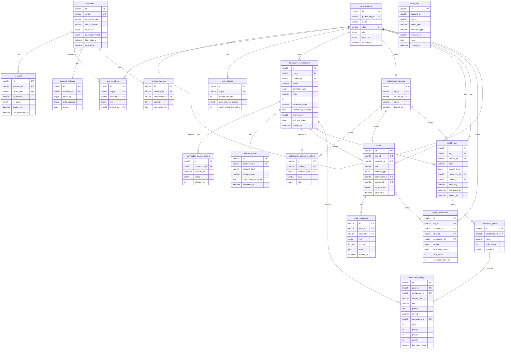

---

## 4. Redis Key Design

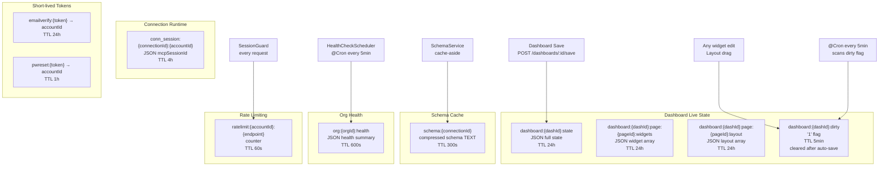

**Key pattern summary:**

| Key | Type | TTL | Written by | Read by |
|---|---|---|---|---|
| `dashboard:{id}:state` | String (JSON) | 24h | `DashboardService.update*` | `DashboardService.get*` |
| `dashboard:{id}:dirty` | String | 5min | Any edit endpoint | Auto-save cron |
| `dashboard:{id}:page:{pid}:layout` | String (JSON) | 24h | `PATCH /widgets/layout` | Dashboard load |
| `schema:{connId}` | String | 300s | `SchemaService.refresh` | `SchemaService.getCompressed` |
| `conn_session:{connId}:{accId}` | String (JSON) | 4h | `POST /connect` | `QueryService` |
| `org:{orgId}:health` | String (JSON) | 600s | `HealthCheckScheduler` | `GET /orgs/:id/health` |
| `ratelimit:{accId}:{ep}` | Integer | 60s | `SessionGuard` | `SessionGuard` |
| `emailverify:{token}` | String | 24h | `AuthService.register` | `POST /verify-email` |
| `pwreset:{token}` | String | 1h | `AuthService.forgotPassword` | `POST /reset-password` |

---

## 5. Auth & Session Flow

### Registration

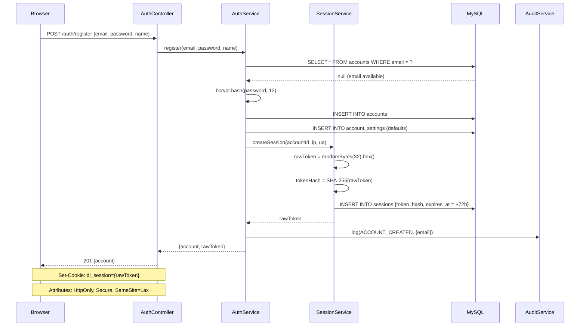

### Login

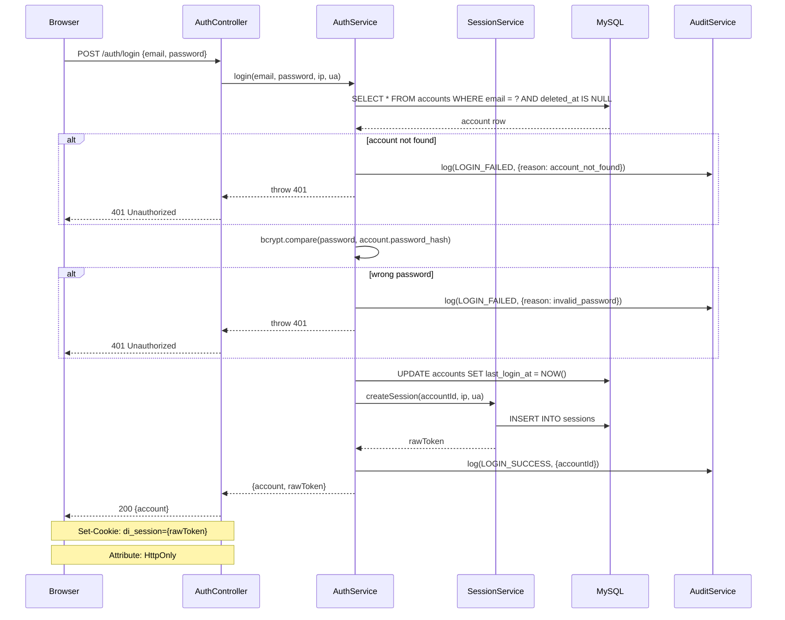

### Every Authenticated Request (SessionGuard)

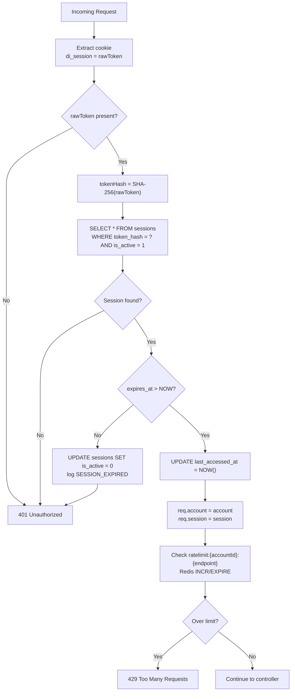

### Logout

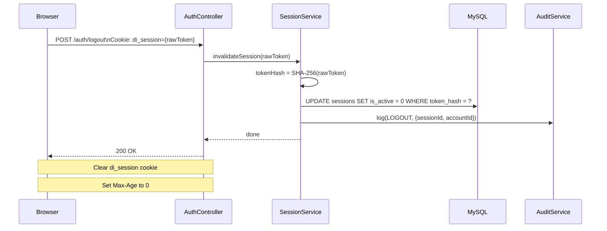

---

## 6. Org & Role Model

### Hierarchy Structure

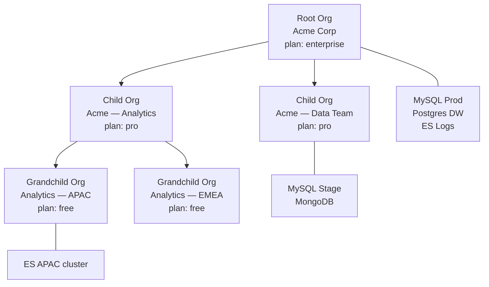

### Role Permissions Matrix

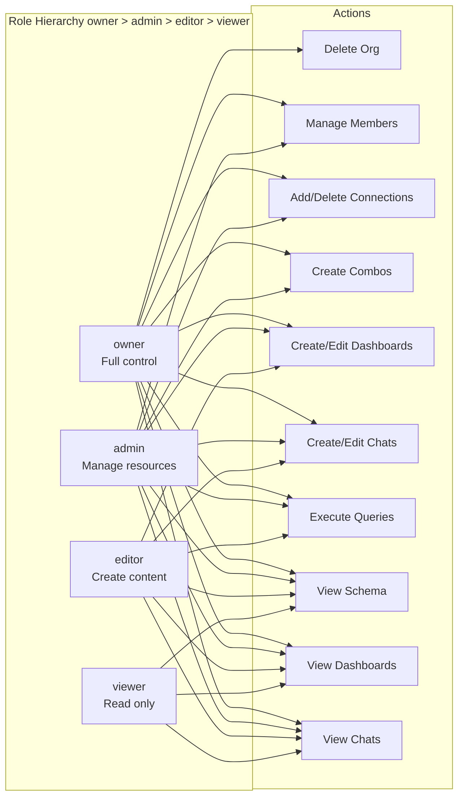

### OrgGuard Flow

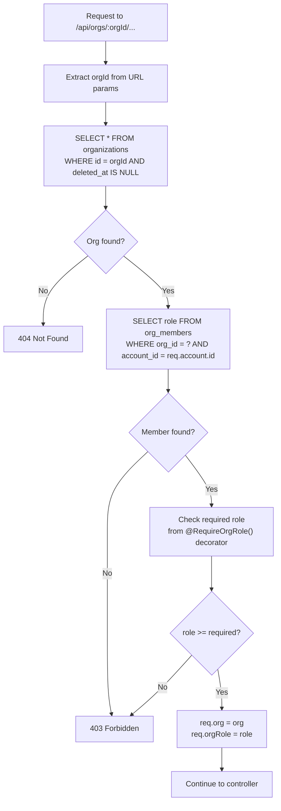

---

## 7. Datasource Connection Lifecycle

### Add & Connect Flow

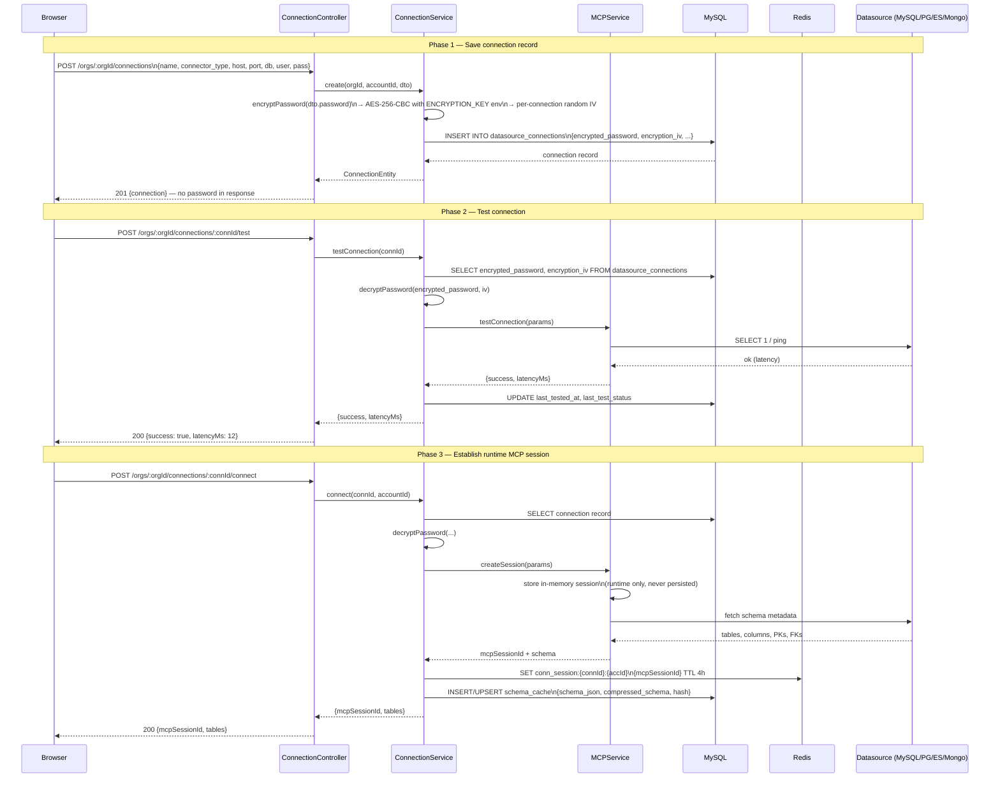

### Health Check Scheduler

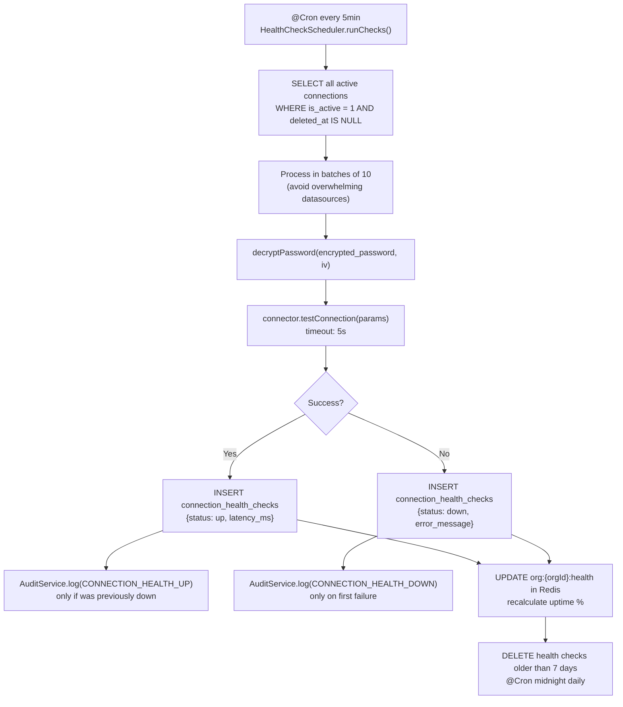

---

## 8. Query Pipeline (Chat Level)

### Full NL → Execute Pipeline

```mermaid
flowchart TD
    USER_MSG["User types question in chat"] --> POST_ASK

    subgraph ASK["POST /orgs/:orgId/chats/:chatId/query/ask"]
        POST_ASK["ChatController.ask(chatId, prompt)"]
        POST_ASK --> LOAD_CHAT["ChatService.getChat(chatId)\nverify account access"]
        LOAD_CHAT --> LOAD_SESSION["load mcpSession\nfrom Redis conn_session:{connId}:{accId}\nor re-establish if expired"]
        LOAD_SESSION --> SESSION_OK{Session active?}
        SESSION_OK -- No --> RECONNECT["ConnectionService.reconnect(connId)\ndecrypt from MySQL → new MCP session"]
        RECONNECT --> SCHEMA_LOAD
        SESSION_OK -- Yes --> SCHEMA_LOAD["SchemaService.getCompressed(connId)\nRedis-first → MySQL → live fetch"]
        SCHEMA_LOAD --> MEMORY_LOAD["MemoryService.getContextWindow(chatId)\nlast N messages from chat_messages table\n+ summary if compacted"]
        MEMORY_LOAD --> PERSIST_USER["INSERT chat_messages\n{role: user, content: prompt}"]
        PERSIST_USER --> BUILD_CONTEXT["PromptBuilderService.assembleContext(\n schema, memory, prompt, connectorFamily)"]
        BUILD_CONTEXT --> LLM_CALL["LLMService.generateSQL(context)\ntemp=0.1 · max_tokens=2048"]
        LLM_CALL --> PARSE{Parse LLM response}
        PARSE -- SQL/MongoDB --> VALIDATE_SQL["ValidationService.validate(sql, schemaGraph)\n10 AST rules"]
        PARSE -- ES DSL --> VALIDATE_ES["ESValidationService.validate(dsl, schemaGraph)\nAuto-retry once on REJECT"]
        VALIDATE_SQL --> VERDICT{Verdict}
        VALIDATE_ES --> VERDICT
        VERDICT -- REJECT --> RECORD_REJECT["INSERT query_executions\n{verdict: REJECT, reasons}"]
        RECORD_REJECT --> AUDIT_REJECT["AuditService.log(QUERY_REJECTED)"]
        AUDIT_REJECT --> PERSIST_ASSISTANT_REJECT["INSERT chat_messages\n{role: assistant, meta: {verdict: REJECT}}"]
        PERSIST_ASSISTANT_REJECT --> RETURN_REJECT["Return {verdict: REJECT, reasons} to browser"]
        VERDICT -- ACCEPT --> PERSIST_PLAN["INSERT query_executions\n{verdict: ACCEPT, sql, prompt}"]
        PERSIST_PLAN --> AUDIT_PLAN["AuditService.log(QUERY_PLAN_GENERATED)"]
        AUDIT_PLAN --> RETURN_PLAN["Return QueryPlanResult to browser\n{sql, explanation, confidence, ui_hint}"]
    end

    RETURN_PLAN --> USER_APPROVE{User approves?}
    USER_APPROVE -- No / Reject --> DONE["Chat shows plan only\nno execution"]
    USER_APPROVE -- Yes --> POST_EXECUTE

    subgraph EXECUTE["POST /orgs/:orgId/chats/:chatId/query/execute"]
        POST_EXECUTE["ChatController.execute(chatId, sql, approved=true)"]
        POST_EXECUTE --> REVALIDATE["Re-validate SQL (defense-in-depth)\nSame rules — treat as untrusted"]
        REVALIDATE --> REVALIDATE_OK{Valid?}
        REVALIDATE_OK -- No --> THROW_400["throw 400 ValidationRejection"]
        REVALIDATE_OK -- Yes --> MCP_EXEC["MCPService.executeReadQuery(mcpSessionId, sql)\nTimeout: 30s · Row cap: 500"]
        MCP_EXEC --> DB_QUERY["Connector.executeReadQuery()\nMySQL/PG/ES/Mongo"]
        DB_QUERY --> ROWS["rows[], columns[], executionTimeMs, totalHits"]
        ROWS --> APPEND_MEMORY["MemoryService.appendResultSummary(chatId)\ntop 10 rows → last assistant message"]
        APPEND_MEMORY --> LLM_INSIGHT["LLMService.interpretResults()\ntemp=0.35 · max_tokens=320"]
        LLM_INSIGHT --> UPDATE_EXEC["UPDATE query_executions SET row_count, execution_time_ms"]
        UPDATE_EXEC --> PERSIST_RESULT["INSERT chat_messages\n{role: assistant, meta: {sql, rows, insight, ui_hint}}"]
        PERSIST_RESULT --> AUDIT_EXEC["AuditService.log(QUERY_EXECUTED,\n{sql, row_count, execution_time_ms})"]
        AUDIT_EXEC --> RETURN_RESULT["Return QueryExecutionResult\n{rows, columns, insight, ui_hint}"]
    end

    RETURN_RESULT --> RENDER["Frontend renders:\nGenerativeUIRenderer → chart/table\n+ AI insight + metadata strip"]
```

### Memory / Context Window (Persisted)

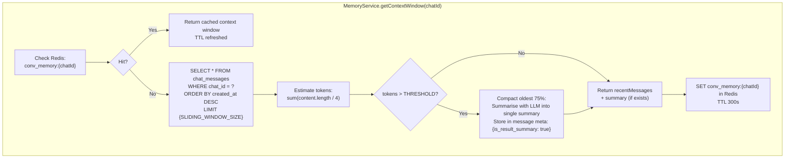

---

## 9. Dashboard State Machine

### Dashboard Scopes

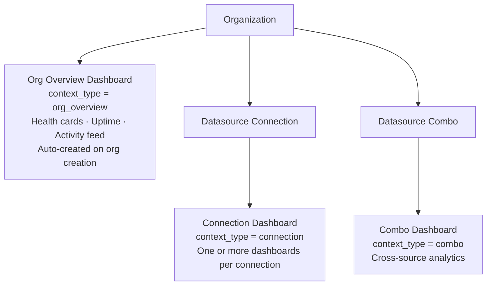

### Multi-Page Dashboard Structure

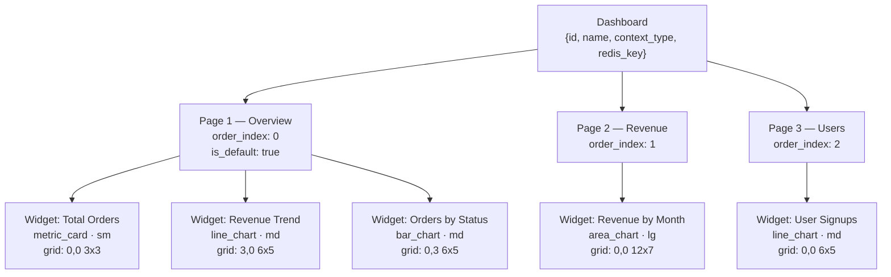

### Redis ↔ MySQL State Flow

```stateDiagram-v2
    [*] --> MYSQL_ONLY: Dashboard created\nPOST /dashboards\n(INSERT dashboards + default page)

    MYSQL_ONLY --> REDIS_LIVE: User opens dashboard\nGET /dashboards/:id/state\n(load MySQL → write to Redis)

    REDIS_LIVE --> REDIS_LIVE: Widget edit / layout drag\nPATCH /widgets/layout\n(write only to Redis)\n(set dirty flag TTL 5min)

    REDIS_LIVE --> REDIS_LIVE: Widget execute\nPOST /widgets/:id/execute\n(update Redis widget result)

    REDIS_LIVE --> AUTO_SAVE: Auto-save cron\nevery 5min\n(dirty flag present)

    AUTO_SAVE --> REDIS_LIVE: Flush Redis → MySQL\nUPDATE dashboard_widgets\nUPDATE dashboards.last_saved_at\nClear dirty flag\nlog(DASHBOARD_AUTO_SAVED)

    REDIS_LIVE --> EXPLICIT_SAVE: User clicks Save\nPOST /dashboards/:id/save

    EXPLICIT_SAVE --> MYSQL_SYNCED: Full Redis → MySQL flush\nlog(DASHBOARD_SAVED)\nupdate last_saved_at

    MYSQL_SYNCED --> REDIS_LIVE: Continue editing

    REDIS_LIVE --> EVICTED: Redis TTL expires\n(24h idle)

    EVICTED --> MYSQL_ONLY: Redis key gone\nMySQL has last saved state

    MYSQL_ONLY --> REDIS_LIVE: User reopens\n(reload from MySQL)
```

### Dashboard Page Tab Interaction (Frontend)

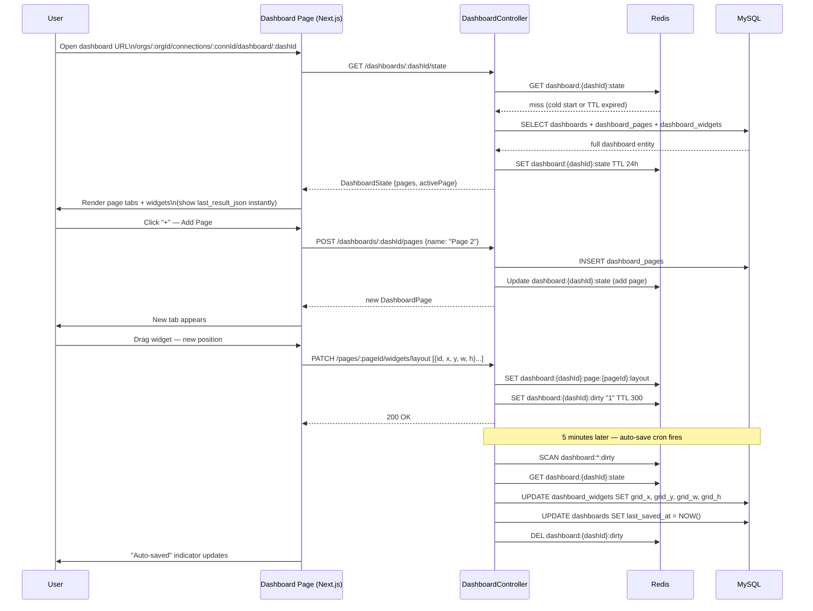

### Widget Execution Flow (Dashboard)

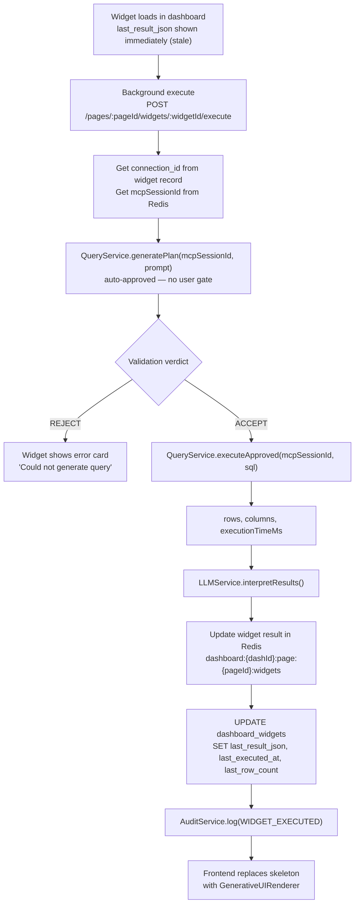

---

## 10. Health Check & Monitoring Flow

### Org Overview Dashboard Auto-Generation

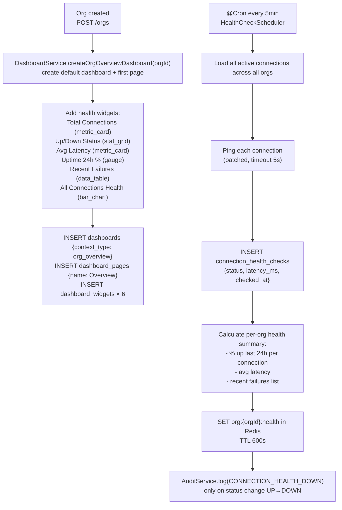

### Health Summary API Response Shape

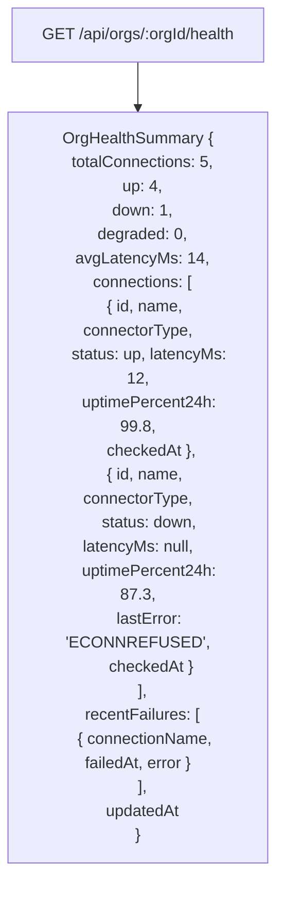

---

## 11. Frontend Routing & Page Tree

```mermaid
graph TD
    subgraph AUTH["Auth (unauthenticated)"]
        LOGIN["/auth/login"]
        REGISTER["/auth/register"]
        FORGOT["/auth/forgot-password"]
        RESET["/auth/reset-password"]
        VERIFY["/auth/verify-email"]
    end

    subgraph ORG_ROOT["Org Space (requires SessionGuard + OrgGuard)"]
        ORGS["/orgs\nOrg switcher list"]
        ORG_NEW["/orgs/new\nCreate org"]

        subgraph ORG_SCOPE["/orgs/[orgId]"]
            ORG_DASH["/orgs/[orgId]\nOrg overview dashboard\nHealth · Uptime · Activity"]
            ORG_SETTINGS["/orgs/[orgId]/settings\nSettings + members + audit log"]
            ORG_MEMBERS["/orgs/[orgId]/members"]
            ORG_SUBORGS["/orgs/[orgId]/sub-orgs"]

            subgraph CONNECTIONS["/orgs/[orgId]/connections"]
                CONN_LIST["/connections\nAll connections grid"]
                CONN_NEW["/connections/new\nMulti-step form"]
                CONN_DETAIL["/connections/[connId]\nDetail + health chart"]

                subgraph CONN_SCOPE["Connection scope"]
                    CONN_CHAT["/connections/[connId]/chat\nChat list + new chat"]
                    CONN_CHAT_ID["/connections/[connId]/chat/[chatId]\nSpecific thread"]
                    CONN_SCHEMA["/connections/[connId]/schema\nSchema explorer"]
                    CONN_ERD["/connections/[connId]/schema/erd\nERD diagram"]
                    CONN_DASH_LIST["/connections/[connId]/dashboard\nDashboard list"]
                    CONN_DASH_ID["/connections/[connId]/dashboard/[dashId]\nMulti-page dashboard"]
                end
            end

            subgraph COMBOS["/orgs/[orgId]/combos"]
                COMBO_LIST["/combos\nCombos list"]
                COMBO_NEW["/combos/new\nPick connections + roles"]

                subgraph COMBO_SCOPE["Combo scope"]
                    COMBO_CHAT["/combos/[comboId]/chat\nChat list"]
                    COMBO_CHAT_ID["/combos/[comboId]/chat/[chatId]"]
                    COMBO_DASH["/combos/[comboId]/dashboard\nDashboard list"]
                    COMBO_DASH_ID["/combos/[comboId]/dashboard/[dashId]"]
                end
            end
        end
    end

    subgraph ACCOUNT["Account (any authenticated user)"]
        ACC_SETTINGS["/account/settings\nTheme · row limit · SQL visibility"]
        ACC_ACTIVITY["/account/activity\nPersonal audit log"]
    end

    LANDING["/\nLanding page"] -- logged in --> ORGS
    LANDING -- not logged in --> LOGIN
    LOGIN --> ORGS
    REGISTER --> ORGS
```

### Shared App Shell Layout

```mermaid
graph TD
    APP_SHELL["OrgLayout\n/orgs/[orgId]/layout.tsx"] --> TOP_NAV["TopNav\nLogo · OrgSwitcher · AccountMenu"]
    APP_SHELL --> LEFT_SIDEBAR["LeftSidebar\n(persistent, collapsible)"]
    APP_SHELL --> PAGE_CONTENT["Page Content\nchanges per route"]

    LEFT_SIDEBAR --> NAV_OVERVIEW["Overview"]
    LEFT_SIDEBAR --> NAV_CONNS["Connections\n(expandable list)"]
    LEFT_SIDEBAR --> NAV_COMBOS["Combos"]
    LEFT_SIDEBAR --> NAV_SUBORGS["Sub-orgs"]
    LEFT_SIDEBAR --> NAV_MEMBERS["Members"]
    LEFT_SIDEBAR --> NAV_SETTINGS["Settings"]

    NAV_CONNS --> CONN_ITEM["Connection item\n● status dot · name · type badge"]
    CONN_ITEM --> CONN_LINKS["↳ Chat\n↳ Schema\n↳ Dashboard"]
```

---

## 12. Backend Module Graph

```mermaid
graph TD
    subgraph GLOBAL["Global Modules (injectable everywhere)"]
        CONFIG_MOD["ConfigModule\nenv vars + validation"]
        DB_MOD["DatabaseModule\nTypeORM + MySQL"]
        REDIS_MOD["RedisModule\nioredis singleton"]
        CRYPTO_MOD["CryptoModule\nAES-256 · bcrypt helpers"]
        AUDIT_MOD["AuditModule\nfire-and-forget queue"]
        MCP_MOD["MCPModule\nruntime connector sessions"]
        SCHEMA_MOD["SchemaModule\ncache-aside strategy"]
        VALID_MOD["ValidationModule\nSQL + ES DSL rules"]
        MEMORY_MOD["MemoryModule\nsliding window → MySQL"]
        LLM_MOD["LLMModule\nOpenRouter + PromptBuilder"]
    end

    subgraph FEATURE["Feature Modules"]
        AUTH_MOD["AuthModule\n/auth/*"]
        ORG_MOD["OrgModule\n/orgs/*"]
        CONN_MOD["ConnectionModule\n/orgs/:id/connections/*"]
        COMBO_MOD["ComboModule\n/orgs/:id/combos/*"]
        CHAT_MOD["ChatModule\n/orgs/:id/chats/*"]
        DASH_MOD["DashboardModule\n/orgs/:id/dashboards/*"]
        QUERY_MOD["QueryModule\n/orgs/:id/chats/:id/query/*"]
        SCHEMA_ROUTE_MOD["SchemaRouteModule\n/orgs/:id/schema/*"]
    end

    AUTH_MOD --> DB_MOD
    AUTH_MOD --> REDIS_MOD
    AUTH_MOD --> CRYPTO_MOD
    AUTH_MOD --> AUDIT_MOD

    ORG_MOD --> DB_MOD
    ORG_MOD --> REDIS_MOD
    ORG_MOD --> AUDIT_MOD

    CONN_MOD --> DB_MOD
    CONN_MOD --> REDIS_MOD
    CONN_MOD --> CRYPTO_MOD
    CONN_MOD --> MCP_MOD
    CONN_MOD --> SCHEMA_MOD
    CONN_MOD --> AUDIT_MOD

    COMBO_MOD --> DB_MOD
    COMBO_MOD --> AUDIT_MOD

    CHAT_MOD --> DB_MOD
    CHAT_MOD --> QUERY_MOD
    CHAT_MOD --> AUDIT_MOD

    QUERY_MOD --> MCP_MOD
    QUERY_MOD --> LLM_MOD
    QUERY_MOD --> VALID_MOD
    QUERY_MOD --> SCHEMA_MOD
    QUERY_MOD --> MEMORY_MOD
    QUERY_MOD --> DB_MOD
    QUERY_MOD --> AUDIT_MOD

    DASH_MOD --> DB_MOD
    DASH_MOD --> REDIS_MOD
    DASH_MOD --> QUERY_MOD
    DASH_MOD --> AUDIT_MOD

    SCHEMA_ROUTE_MOD --> DB_MOD
    SCHEMA_ROUTE_MOD --> REDIS_MOD
    SCHEMA_ROUTE_MOD --> SCHEMA_MOD
    SCHEMA_ROUTE_MOD --> MCP_MOD
    SCHEMA_ROUTE_MOD --> AUDIT_MOD

    MEMORY_MOD --> DB_MOD
    MEMORY_MOD --> REDIS_MOD
    SCHEMA_MOD --> DB_MOD
    SCHEMA_MOD --> REDIS_MOD
```

### New TypeORM Entities Required

```mermaid
graph LR
    subgraph ENTITIES["TypeORM Entities (new files)"]
        E1["AccountEntity\nsrc/auth/entities/account.entity.ts"]
        E2["SessionEntity\nsrc/auth/entities/session.entity.ts"]
        E3["OrgEntity\nsrc/org/entities/org.entity.ts"]
        E4["OrgMemberEntity\nsrc/org/entities/org-member.entity.ts"]
        E5["OrgInvitationEntity\nsrc/org/entities/org-invitation.entity.ts"]
        E6["OrgSettingsEntity\nsrc/org/entities/org-settings.entity.ts"]
        E7["AccountSettingsEntity\nsrc/auth/entities/account-settings.entity.ts"]
        E8["DatasourceConnectionEntity\nsrc/connection/entities/connection.entity.ts"]
        E9["ConnectionHealthCheckEntity\nsrc/connection/entities/health-check.entity.ts"]
        E10["SchemaCacheEntity\nsrc/schema/entities/schema-cache.entity.ts"]
        E11["DatasourceComboEntity\nsrc/combo/entities/combo.entity.ts"]
        E12["ComboMemberEntity\nsrc/combo/entities/combo-member.entity.ts"]
        E13["ChatEntity\nsrc/chat/entities/chat.entity.ts"]
        E14["ChatMessageEntity\nsrc/chat/entities/chat-message.entity.ts"]
        E15["PinnedQueryEntity\nsrc/chat/entities/pinned-query.entity.ts"]
        E16["QueryExecutionEntity\nsrc/query/entities/query-execution.entity.ts"]
        E17["DashboardEntity\nsrc/dashboard/entities/dashboard.entity.ts"]
        E18["DashboardPageEntity\nsrc/dashboard/entities/dashboard-page.entity.ts"]
        E19["DashboardWidgetEntity\nsrc/dashboard/entities/dashboard-widget.entity.ts"]
        E20["AuditLogEntity\nsrc/audit/entities/audit-log.entity.ts"]
    end
```

---

## 13. API Route Map

```mermaid
graph TD
    subgraph AUTH_ROUTES["/api/auth"]
        AR1["POST /register"]
        AR2["POST /login"]
        AR3["POST /logout"]
        AR4["GET /me"]
        AR5["POST /verify-email"]
        AR6["POST /forgot-password"]
        AR7["POST /reset-password"]
    end

    subgraph ORG_ROUTES["/api/orgs"]
        OR1["POST /  — create org"]
        OR2["GET /   — list my orgs"]
        OR3["GET /:orgId"]
        OR4["PATCH /:orgId"]
        OR5["DELETE /:orgId"]
        OR6["GET /:orgId/children"]
        OR7["GET /:orgId/members"]
        OR8["POST /:orgId/members/invite"]
        OR9["PATCH /:orgId/members/:memberId"]
        OR10["DELETE /:orgId/members/:memberId"]
        OR11["GET /:orgId/settings"]
        OR12["PATCH /:orgId/settings"]
        OR13["GET /:orgId/health"]
    end

    subgraph CONN_ROUTES["/api/orgs/:orgId/connections"]
        CR1["POST /"]
        CR2["GET /"]
        CR3["GET /:connId"]
        CR4["PATCH /:connId"]
        CR5["DELETE /:connId"]
        CR6["POST /:connId/test"]
        CR7["POST /:connId/connect"]
        CR8["POST /:connId/disconnect"]
        CR9["GET /:connId/status"]
        CR10["GET /:connId/health"]
        CR11["GET /:connId/schema"]
        CR12["POST /:connId/schema/refresh"]
        CR13["POST /:connId/schema/explain"]
    end

    subgraph COMBO_ROUTES["/api/orgs/:orgId/combos"]
        COMBR1["POST /"]
        COMBR2["GET /"]
        COMBR3["GET /:comboId"]
        COMBR4["PATCH /:comboId"]
        COMBR5["DELETE /:comboId"]
        COMBR6["POST /:comboId/members"]
        COMBR7["DELETE /:comboId/members/:connId"]
    end

    subgraph CHAT_ROUTES["/api/orgs/:orgId/chats"]
        CHATR1["POST /"]
        CHATR2["GET /"]
        CHATR3["GET /:chatId"]
        CHATR4["PATCH /:chatId"]
        CHATR5["DELETE /:chatId"]
        CHATR6["POST /:chatId/query/ask"]
        CHATR7["POST /:chatId/query/execute"]
        CHATR8["GET /:chatId/query/stream  SSE"]
        CHATR9["GET /:chatId/query/history"]
    end

    subgraph DASH_ROUTES["/api/orgs/:orgId/dashboards"]
        DR1["POST /"]
        DR2["GET /"]
        DR3["GET /:dashId"]
        DR4["PATCH /:dashId"]
        DR5["DELETE /:dashId"]
        DR6["POST /:dashId/save"]
        DR7["GET /:dashId/state"]
        DR8["POST /:dashId/generate"]
        DR9["POST /:dashId/pages"]
        DR10["GET /:dashId/pages"]
        DR11["PATCH /:dashId/pages/:pageId"]
        DR12["DELETE /:dashId/pages/:pageId"]
        DR13["POST /:dashId/pages/:pageId/widgets"]
        DR14["GET /:dashId/pages/:pageId/widgets"]
        DR15["PATCH /:dashId/pages/:pageId/widgets/:widgetId"]
        DR16["DELETE /:dashId/pages/:pageId/widgets/:widgetId"]
        DR17["POST /:dashId/pages/:pageId/widgets/:widgetId/execute"]
        DR18["PATCH /:dashId/pages/:pageId/widgets/layout"]
    end

    subgraph ACCOUNT_ROUTES["/api/account"]
        ACCR1["GET /settings"]
        ACCR2["PATCH /settings"]
        ACCR3["GET /pinned-queries"]
        ACCR4["POST /pinned-queries"]
        ACCR5["DELETE /pinned-queries/:id"]
    end
```

---

## 14. Implementation Phases

```mermaid
gantt
    title DataIntel Implementation Roadmap
    dateFormat  YYYY-MM-DD
    section Phase 1 — Infrastructure
    MySQL schema + TypeORM entities     :p1a, 2026-06-05, 3d
    DatabaseModule + RedisModule        :p1b, after p1a, 2d
    Docker compose update               :p1c, after p1a, 1d
    Env var extensions                  :p1d, after p1a, 1d

    section Phase 2 — Auth
    AuthModule backend                  :p2a, after p1b, 3d
    SessionService + SessionGuard       :p2b, after p2a, 2d
    AuditModule + AuditService          :p2c, after p2a, 2d
    Auth UI pages frontend              :p2d, after p2b, 3d

    section Phase 3 — Orgs
    OrgModule backend                   :p3a, after p2c, 3d
    Org hierarchy + invitations         :p3b, after p3a, 2d
    Org shell layout frontend           :p3c, after p3a, 3d
    Org settings + members UI           :p3d, after p3c, 2d

    section Phase 4 — Connections
    ConnectionModule rewrite            :p4a, after p3b, 3d
    HealthCheckScheduler                :p4b, after p4a, 2d
    Schema cache persistence            :p4c, after p4a, 2d
    Connections UI frontend             :p4d, after p4a, 3d
    Org overview health grid            :p4e, after p4b, 2d

    section Phase 5 — Combos
    ComboModule backend                 :p5a, after p4c, 2d
    Combo UI frontend                   :p5b, after p5a, 2d

    section Phase 6 — Chats
    ChatModule backend                  :p6a, after p5a, 3d
    MemoryService → MySQL               :p6b, after p6a, 2d
    Chat UI frontend                    :p6c, after p6a, 3d

    section Phase 7 — Dashboards
    DashboardModule backend             :p7a, after p6b, 3d
    Redis live state + auto-save        :p7b, after p7a, 2d
    Multi-page dashboard UI             :p7c, after p7a, 4d
    Org overview dashboard              :p7d, after p7b, 2d

    section Phase 8 — Schema & Polish
    Schema route module                 :p8a, after p7b, 2d
    Schema UI re-scope                  :p8b, after p8a, 2d
    Account settings + audit UI         :p8c, after p8a, 2d
```

### Phase Details

#### Phase 1 — Infrastructure (Days 1–6)

| Task | Files to create/modify |
|---|---|
| Add packages to `backend/package.json` | `@nestjs/typeorm`, `typeorm`, `ioredis`, `@nestjs/schedule`, `bcrypt`, `cookie-parser`, `@types/bcrypt`, `@types/cookie-parser` |
| `DatabaseModule` | `src/database/database.module.ts` |
| `RedisModule` | `src/redis/redis.module.ts`, `src/redis/redis.service.ts` |
| All 20 TypeORM entities | `src/*/entities/*.entity.ts` |
| Initial migration | `migrations/001_initial_schema.sql` |
| Updated `docker-compose.yml` | Add `mysql_persistence` + `redis` services |
| Extend `env.validation.ts` | Add MySQL, Redis, session, encryption vars |
| Update `app.module.ts` | Import `DatabaseModule`, `RedisModule` |

**New env vars:**
```env
# Persistence
MYSQL_HOST=localhost
MYSQL_PORT=3306
MYSQL_USER=dataintel
MYSQL_PASSWORD=...
MYSQL_DATABASE=dataintel

# Redis
REDIS_HOST=localhost
REDIS_PORT=6379
REDIS_PASSWORD=...

# Security
ENCRYPTION_KEY=<32-byte hex — for AES-256-CBC connection passwords>
BCRYPT_ROUNDS=12
SESSION_TTL_HOURS=72
```

**docker-compose additions:**
```yaml
mysql_persistence:
  image: mysql:8.0
  environment:
    MYSQL_DATABASE: dataintel
    MYSQL_USER: dataintel
    MYSQL_PASSWORD: ${MYSQL_PASSWORD}
    MYSQL_ROOT_PASSWORD: ${MYSQL_ROOT_PASSWORD}
  volumes:
    - mysql_data:/var/lib/mysql
    - ./migrations/001_initial_schema.sql:/docker-entrypoint-initdb.d/001_schema.sql
  ports:
    - "3306:3306"
  healthcheck:
    test: ["CMD", "mysqladmin", "ping", "-h", "localhost"]
    interval: 10s
    timeout: 5s
    retries: 5

redis:
  image: redis:7-alpine
  command: redis-server --requirepass ${REDIS_PASSWORD} --appendonly yes
  volumes:
    - redis_data:/data
  ports:
    - "6379:6379"

volumes:
  mysql_data:
  redis_data:
```

---

#### Phase 2 — Auth & Session (Days 4–10)

| Task | Files |
|---|---|
| `AuthModule` | `src/auth/auth.module.ts` |
| `AuthController` | `src/auth/auth.controller.ts` — register, login, logout, me, verify, forgot, reset |
| `AuthService` | `src/auth/auth.service.ts` |
| `SessionService` | `src/auth/session.service.ts` — cookie creation, SHA-256 token hash, TTL |
| `SessionGuard` | `src/auth/guards/session.guard.ts` — global guard |
| `AuditModule` | `src/audit/audit.module.ts` |
| `AuditService` | `src/audit/audit.service.ts` — micro-queue, flush to MySQL |
| `AuditLogEntity` | `src/audit/entities/audit-log.entity.ts` |
| Update `main.ts` | Add `cookie-parser` middleware |
| Frontend: `/auth/login` | `frontend/src/app/auth/login/page.tsx` |
| Frontend: `/auth/register` | `frontend/src/app/auth/register/page.tsx` |
| Frontend: `AuthProvider` | `frontend/src/components/providers/auth-provider.tsx` |
| Frontend: `middleware.ts` | Next.js middleware — redirect to login if no session |

---

#### Phase 3 — Orgs (Days 8–14)

| Task | Files |
|---|---|
| `OrgModule` | `src/org/org.module.ts` |
| `OrgController` | `src/org/org.controller.ts` |
| `OrgService` | `src/org/org.service.ts` — CRUD, hierarchy, invitations |
| `OrgGuard` | `src/org/guards/org.guard.ts` — role check |
| `RequireOrgRole` decorator | `src/org/decorators/require-role.decorator.ts` |
| `OrgHealthService` | `src/org/org-health.service.ts` |
| Frontend: `/orgs` | `frontend/src/app/orgs/page.tsx` |
| Frontend: `OrgLayout` | `frontend/src/app/orgs/[orgId]/layout.tsx` |
| Frontend: `/orgs/[orgId]` | `frontend/src/app/orgs/[orgId]/page.tsx` |

---

#### Phase 4 — Connections (Days 12–18)

| Task | Files |
|---|---|
| `ConnectionModule` rewrite | `src/connection/connection.module.ts` |
| `ConnectionController` | `src/connection/connection.controller.ts` |
| `ConnectionService` | `src/connection/connection.service.ts` — MySQL CRUD + MCP bootstrap |
| `HealthCheckScheduler` | `src/connection/health-check.scheduler.ts` |
| `SchemaService` update | Add MySQL cache read/write in `src/schema/schema.service.ts` |
| Frontend: connections list | `frontend/src/app/orgs/[orgId]/connections/page.tsx` |
| Frontend: new connection | `frontend/src/app/orgs/[orgId]/connections/new/page.tsx` |
| Frontend: connection detail | `frontend/src/app/orgs/[orgId]/connections/[connId]/page.tsx` |

---

#### Phase 5 — Combos (Days 17–21)

| Task | Files |
|---|---|
| `ComboModule` | `src/combo/combo.module.ts` |
| `ComboController` | `src/combo/combo.controller.ts` |
| `ComboService` | `src/combo/combo.service.ts` |
| Frontend: combos | `frontend/src/app/orgs/[orgId]/combos/` |

---

#### Phase 6 — Chats (Days 19–25)

| Task | Files |
|---|---|
| `ChatModule` | `src/chat/chat.module.ts` |
| `ChatController` | `src/chat/chat.controller.ts` |
| `ChatService` | `src/chat/chat.service.ts` |
| `MemoryService` rewrite | `src/memory/memory.service.ts` — read/write `chat_messages` table |
| `QueryModule` update | Scope to chat, persist `query_executions` |
| Frontend: chat workspace | `frontend/src/app/orgs/[orgId]/connections/[connId]/chat/` |

---

#### Phase 7 — Dashboards (Days 23–32)

| Task | Files |
|---|---|
| `DashboardModule` | `src/dashboard/dashboard.module.ts` |
| `DashboardController` | `src/dashboard/dashboard.controller.ts` |
| `DashboardService` | `src/dashboard/dashboard.service.ts` — Redis ↔ MySQL |
| `DashboardPageService` | `src/dashboard/dashboard-page.service.ts` |
| `WidgetService` | `src/dashboard/widget.service.ts` |
| Auto-save scheduler | `src/dashboard/auto-save.scheduler.ts` |
| Frontend: multi-page dashboard | Extend `dashboard/page.tsx` — add page tab bar, per-page grid |
| Frontend: save indicator | `SaveStatusIndicator` component |
| Frontend: page manager | `DashboardPageTabs` component |

---

#### Phase 8 — Schema & Polish (Days 30–36)

| Task | Files |
|---|---|
| Schema route module | `src/schema-route/schema-route.module.ts` |
| Re-scope schema UI | Move pages to `connections/[connId]/schema/` |
| Account settings UI | `frontend/src/app/account/settings/page.tsx` |
| Audit log UI | `frontend/src/app/account/activity/page.tsx` |
| Add `@tanstack/react-query` | Replace localStorage patterns in frontend |

---

## 15. Audit Log Event Catalogue

```mermaid
graph TD
    subgraph ACCOUNT_EVENTS["Account Events"]
        AE1["account.created"]
        AE2["account.updated"]
        AE3["account.deleted"]
        AE4["account.password_changed"]
        AE5["account.email_verified"]
    end

    subgraph AUTH_EVENTS["Auth Events"]
        AUTH1["auth.login_success\nmeta: {accountId, ip}"]
        AUTH2["auth.login_failed\nmeta: {reason, email, ip}"]
        AUTH3["auth.logout"]
        AUTH4["auth.session_expired"]
        AUTH5["auth.password_reset_requested"]
        AUTH6["auth.password_reset_completed"]
    end

    subgraph ORG_EVENTS["Org Events"]
        OE1["org.created\nmeta: {name, plan}"]
        OE2["org.updated"]
        OE3["org.deleted"]
        OE4["org.member_invited\nmeta: {email, role}"]
        OE5["org.member_joined"]
        OE6["org.member_removed"]
        OE7["org.member_role_changed\nmeta: {old_role, new_role}"]
    end

    subgraph CONN_EVENTS["Connection Events"]
        CE1["connection.created\nmeta: {connector_type, host}"]
        CE2["connection.updated"]
        CE3["connection.deleted"]
        CE4["connection.tested\nmeta: {status, latency_ms}"]
        CE5["connection.connected"]
        CE6["connection.disconnected"]
        CE7["connection.health_up\nmeta: {latency_ms}"]
        CE8["connection.health_down\nmeta: {error}"]
    end

    subgraph COMBO_EVENTS["Combo Events"]
        COMBE1["combo.created"]
        COMBE2["combo.updated"]
        COMBE3["combo.deleted"]
        COMBE4["combo.member_added\nmeta: {connection_id, alias}"]
        COMBE5["combo.member_removed"]
    end

    subgraph QUERY_EVENTS["Query Events (highest volume)"]
        QE1["query.plan_generated\nmeta: {prompt, verdict, tables_used, confidence}"]
        QE2["query.executed\nmeta: {sql, row_count, execution_time_ms, connector_type}"]
        QE3["query.rejected\nmeta: {prompt, reasons[]}"]
        QE4["query.stream_started"]
        QE5["query.stream_completed"]
    end

    subgraph SCHEMA_EVENTS["Schema Events"]
        SE1["schema.refreshed\nmeta: {table_count, hash}"]
        SE2["schema.explained"]
    end

    subgraph DASH_EVENTS["Dashboard Events"]
        DE1["dashboard.created\nmeta: {context_type}"]
        DE2["dashboard.updated"]
        DE3["dashboard.deleted"]
        DE4["dashboard.saved\nmeta: {page_count, widget_count}"]
        DE5["dashboard.auto_saved"]
        DE6["dashboard.generated\nmeta: {widget_count}"]
        DE7["dashboard.page_created"]
        DE8["dashboard.page_deleted"]
        DE9["widget.added\nmeta: {ui_hint, prompt}"]
        DE10["widget.removed"]
        DE11["widget.executed\nmeta: {prompt, row_count, execution_time_ms}"]
        DE12["widget.layout_updated"]
    end
```

### AuditService Implementation Pattern

```mermaid
sequenceDiagram
    participant CTRL as Any Controller
    participant SVC as AuditService
    participant QUEUE as In-memory Queue
    participant DB as MySQL

    CTRL->>SVC: audit.log({eventType, ...}) — fire-and-forget, NOT awaited
    SVC->>QUEUE: push to batch queue (max 50 items)
    Note over SVC,QUEUE: No await — request continues immediately

    alt Queue has 50+ items OR 500ms timer fires
        SVC->>SVC: dequeue batch
        SVC->>DB: INSERT INTO audit_logs ... (batch insert)
        DB-->>SVC: ok
    end
```

---

## 16. Migration Strategy

### What Is Kept Unchanged

```mermaid
graph TD
    subgraph KEEP["Keep Unchanged — Pure Logic, No Persistence Coupling"]
        CONNECTORS["MCP Connectors\nMySQL · Postgres · MongoDB · ES\nPure execution engines"]
        LLM_SVC["LLMService\nPromptBuilderService\nStateless — no session state"]
        VALID_SVC["ValidationService\nESValidationService\n9-rule deterministic engine"]
        CHART_COMPS["Frontend Chart Components\nGenerativeUIRenderer\nAll visualization components"]
        UI_PRIMS["Frontend UI Primitives\nshadcn components\nTailwind classes"]
    end
```

### What Is Refactored

```mermaid
graph LR
    subgraph OLD["Current (in-memory)"]
        OLD_CONN["ConnectionService\nstores state in Map"]
        OLD_MEM["MemoryService\nstores messages in Map"]
        OLD_STORE["Frontend store.ts\nlocalStorage singleton"]
        OLD_DASH["Dashboard state\nlocalStorage only"]
        OLD_SCHEMA["SchemaService\nMap cache only"]
    end

    subgraph NEW["New (persisted)"]
        NEW_CONN["ConnectionService\npersists to MySQL\nMCP sessions bootstrapped from DB"]
        NEW_MEM["MemoryService\nreads chat_messages table\nRedis cache for window"]
        NEW_STORE["TanStack Query\nserver-state driven"]
        NEW_DASH["DashboardService\nRedis live + MySQL saved"]
        NEW_SCHEMA["SchemaService\nRedis → MySQL → live fetch"]
    end

    OLD_CONN -->|"refactor"| NEW_CONN
    OLD_MEM -->|"refactor"| NEW_MEM
    OLD_STORE -->|"replace"| NEW_STORE
    OLD_DASH -->|"replace"| NEW_DASH
    OLD_SCHEMA -->|"extend"| NEW_SCHEMA
```

### What Is New (Additive)

```mermaid
graph TD
    NEW1["AuthModule\n+ SessionService\n+ SessionGuard"]
    NEW2["AuditModule\n+ AuditService"]
    NEW3["OrgModule\n+ OrgGuard\n+ OrgHealthService"]
    NEW4["ComboModule"]
    NEW5["ChatModule"]
    NEW6["DashboardModule\n+ PageService\n+ WidgetService\n+ AutoSaveScheduler"]
    NEW7["HealthCheckScheduler"]
    NEW8["DatabaseModule\n+ RedisModule\n+ CryptoModule"]
    NEW9["20 TypeORM entities"]
    NEW10["Auth pages frontend\n/auth/*"]
    NEW11["Org pages frontend\n/orgs/*"]
    NEW12["Multi-page dashboard\ntab bar + per-page grid"]

    NEW8 --> NEW1
    NEW8 --> NEW2
    NEW8 --> NEW3
    NEW1 --> NEW10
    NEW3 --> NEW11
    NEW6 --> NEW12
```

### Frontend localStorage Removal Plan

| Current localStorage key | Replacement |
|---|---|
| `sqli_connection` | Cookie `di_session` + URL params (`orgId`, `connId`) |
| `sqli_messages` | `GET /orgs/:orgId/chats/:chatId` — MySQL backed |
| `sqli_dashboard` | `GET /dashboards/:dashId/state` — Redis backed |
| `sqli_settings` | `GET /account/settings` — MySQL backed |
| `sqli_conn_history` | `GET /orgs/:orgId/connections` — MySQL backed |
| `sqli_pinned` | `GET /account/pinned-queries` — MySQL backed |
| `sqli_params` | Never needed again — connection params are server-side |

---

## Summary

### Database Tables: 20 total

| Group | Tables |
|---|---|
| Auth | `accounts`, `sessions`, `account_settings` |
| Orgs | `organizations`, `org_members`, `org_invitations`, `org_settings` |
| Connections | `datasource_connections`, `connection_health_checks`, `schema_cache` |
| Combos | `datasource_combos`, `datasource_combo_members` |
| Chats | `chats`, `chat_messages`, `pinned_queries` |
| Queries | `query_executions` |
| Dashboards | `dashboards`, `dashboard_pages`, `dashboard_widgets` |
| Audit | `audit_logs` |

### Redis Keys: 8 patterns

`dashboard:*:state` · `dashboard:*:dirty` · `dashboard:*:page:*:layout` · `schema:*` · `conn_session:*` · `org:*:health` · `ratelimit:*` · `emailverify:*` / `pwreset:*`

### New Backend Modules: 8

`AuthModule` · `AuditModule` · `OrgModule` · `ConnectionModule` (rewrite) · `ComboModule` · `ChatModule` · `DashboardModule` · `DatabaseModule` + `RedisModule`

### New Frontend Pages: 15+

`/auth/*` (5) · `/orgs` · `/orgs/new` · `/orgs/[orgId]` · `/orgs/[orgId]/connections/**` · `/orgs/[orgId]/combos/**` · `/orgs/[orgId]/sub-orgs` · `/orgs/[orgId]/settings` · `/account/**`

### Audit Events: 40+

Grouped by: account · auth · org · connection · combo · query · schema · dashboard/widget

---

*DataIntel Complete Implementation Plan — June 2026*
*NestJS 10 · Next.js 14 App Router · MySQL 8 · Redis 7 · TypeORM · TanStack Query · Cookie Auth*

---

## 17. Design System & Unified UI Architecture

### 17.1 Centralized Design Tokens
We have abandoned ad-hoc Tailwind utility classes in favor of a strictly enforced design system inspired by Vercel and Linear:
- **Colors (`src/tokens/colors.ts`)**: Premium dark mode utilizing `240` HSL base, `#0A0A0F` background, `#111117` cards.
- **Spacing (`src/tokens/spacing.ts`)**: Fixed scale: 4, 8, 12, 16, 24, 32, 48, 64. No arbitrary values allowed.
- **Typography (`src/tokens/typography.ts`)**: Heading XL/L/M/S, Body Large/Body/Body Small, Caption.

### 17.2 The AppShell Layout Architecture
All application pages share a single `<AppShell>` which manages the global layout:
```html
<AppShell>
  <Sidebar /> <!-- Global navigation + nested context tree -->
  <Topbar />  <!-- Sticky header with user profile -->
  <Content /> <!-- Overflow-managed main area -->
</AppShell>
```
- **Nested Navigation**: The Sidebar supports nested contexts. When viewing a connection (`/connections/[connId]`), the Sidebar dynamically renders nested child links (Overview, Chat, Dashboards, Schema) underneath the active Connection item.
- **No Duplicate Sidebars**: Individual feature pages NO LONGER render their own `<aside>` elements. The layout code is completely DRY.

### 17.3 Dashboard System Vision
Dashboards are no longer just containers for charts; they are primary collaborative workspaces.
- **Context Model**: Dashboards operate in three scopes: `ORG_OVERVIEW`, `CONNECTION`, `COMBO`.
- **Unified Component**: A single `<DashboardBuilder>` and `<DashboardViewer>` is shared across all contexts.
- **Dedicated Routes**: Dashboards live on dedicated routes (e.g., `/orgs/[slug]/connections/[connId]/dashboard/[dashId]`). The Connection Overview page embeds only a lightweight **Preview Panel** with a CTA to open the full dashboard.
- **Grid Requirements**: The dashboard leverages `react-grid-layout` configured for responsive behavior (Target: 2-column desktop, 1-column tablet/mobile).

### 17.4 Core View Redesigns
- **Chat Interface**: Redesigned to a 3-pane layout: Left (History), Center (Conversation), Right (Context/Schema references). Charts/tables returned in chat have an "Add to Dashboard" button.
- **Database Explorer**: Redesigned to a 3-pane layout: Left (Tables list), Center (Schema details), Right (Lineage/AI Insights). Supports dynamic buttons for different datasources (Explain DB, Copy ERD).
- **Overview Command Center**: The main `/orgs/[slug]` overview acts as a command center featuring KPI cards, datasource health, recent queries, and recent dashboards.
